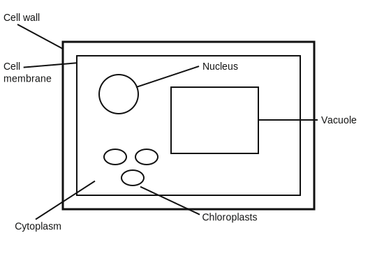
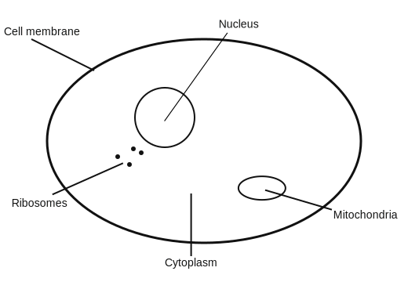
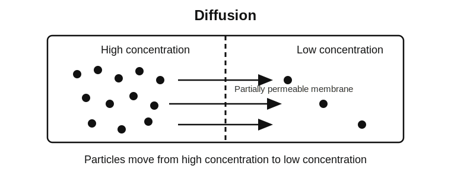
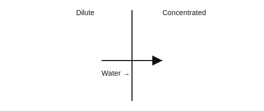

<!-- filename: biology1_cell-biology.md -->

# GCSEs for Dads – Biology 1: Cell Biology

You don’t need to memorise everything here.

Get the core ideas clear first. That’s enough to help with most homework questions.

Scroll down to start.

---

## Key Ideas

| Quantity | Key Idea | Meaning |
|----------|----------|---------|
| Cell | Basic unit of life | Smallest part of a living organism |
| Diffusion | High → low | Particles spread out naturally |
| Osmosis | Water movement | Water moves across a membrane |
| Active Transport | Low → high | Needs energy |
| Mitosis | Identical cells | Used for growth and repair |

---

## Symbols and Units

| Symbol | Meaning | Unit |
|--------|--------|------|
| mm | millimetre | mm |
| μm | micrometre | μm |
| nm | nanometre | nm |

---

# Biology 1: Cell Biology

---

## 1. The Big Idea (30 seconds)

**Cells are the basic building blocks of all living things, and their structure is matched to their job.**

- All living things are made of cells  
- Cells specialise depending on their role  
- Substances move in and out of cells constantly  
- Cells divide to grow and repair  

Think of it like this:  
Different jobs need different tools. Cells are built the same way.

---

## 2. Animal and Plant Cells

There are two main types you need to know.

### Animal cells
- No cell wall  
- No chloroplasts  
- Flexible shape  

### Plant cells
- Cell wall (rigid support)  
- Chloroplasts (photosynthesis)  
- Vacuole (keeps shape)

**Key idea:**  
Plant cells are more structured because they need support.

---

## 3. Cell Structure (what actually matters)

Focus on the function, not just the name.

- **Nucleus** → controls the cell, contains DNA  
- **Cytoplasm** → where reactions happen  
- **Cell membrane** → controls entry and exit  
- **Mitochondria** → releases energy  
- **Ribosomes** → make proteins  

Plant-only:

- **Cell wall** → strength  
- **Chloroplasts** → photosynthesis  
- **Vacuole** → keeps cell rigid  

#### Plant Cell

#### Animal Cell

**Key idea:**  
If you know the job, you can work out the structure.

---

## 4. Specialised Cells

Cells are adapted for specific roles.

- **Sperm cell**  
  - Tail for movement  
  - Lots of mitochondria  

- **Nerve cell**  
  - Long to carry signals  

- **Muscle cell**  
  - Contracts to create movement  

- **Root hair cell**  
  - Large surface area for absorption  

**Key idea:**  
Structure matches function every time.

---

## 5. Microscopes and Magnification

- Light microscope → basic detail  
- Electron microscope → much higher detail  

**Magnification = image size ÷ real size**

Example:
- Image = 10 mm  
- Real size = 0.01 mm  
- Magnification = 1000  

**Key idea:**  
Magnification is not the same as clarity. That is resolution.

---

## 6. Mitosis (Cell Division)

Used for:
- Growth  
- Repair  

Process:
- DNA copied  
- Cell splits  

Result:
- Two identical cells  

**Key idea:**  
Mitosis produces identical cells.

---

## 7. Stem Cells

- Can turn into other cell types  

Types:
- Embryonic → any cell  
- Adult → limited range  

Used in:
- Potential treatments (e.g. damaged tissue)

---

## 8. Diffusion

- Movement from high to low concentration  
- No energy needed  

Example:
- Oxygen moving into cells  

**Key idea:**  
Particles spread out naturally.

---

## 9. Osmosis

- Movement of water only  
- Across a partially permeable membrane  
- From dilute to concentrated  

**Key idea:**  
Water moves to where there is less water.

---

## 10. Active Transport

- Movement from low to high concentration  
- Requires energy  

Example:
- Plants absorbing minerals from soil  

**Key idea:**  
This goes against the gradient, so it needs energy.

---

## Common Mistakes

- Mixing up diffusion and osmosis (osmosis is water only)  
- Forgetting active transport needs energy  
- Thinking mitosis produces different cells  
- Not linking structure to function  

---

## Check Your Understanding

- What is the role of the nucleus? (Controls the cell and contains DNA)  
- Name one structure only found in plant cells (Cell wall / chloroplast / vacuole)  
- What direction does diffusion move? (High to low concentration)  
- What moves in osmosis? (Water only)  
- Why do specialised cells have different shapes? (To do specific jobs)  
- What does mitosis produce? (Two identical cells)  

---

## Useful Videos

- [Cells](https://youtu.be/qHkUOlC8Nbo?si=-kczW8h7cLPj7EMS)
- [Differentiation and Specialised Cells](https://youtu.be/LNLz7mswPkQ?si=5PJ8ug--rFdRdfq7)
- [Active Transport](https://youtu.be/tM0bGaaQ2jY?si=pQfwoUdMUbsccJVN)