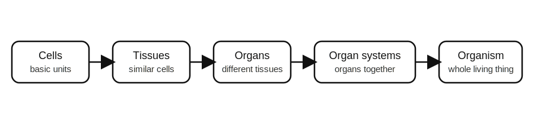
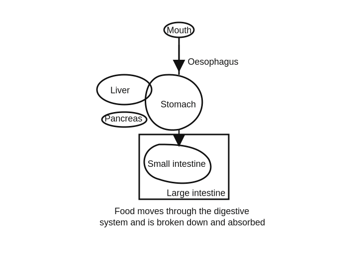
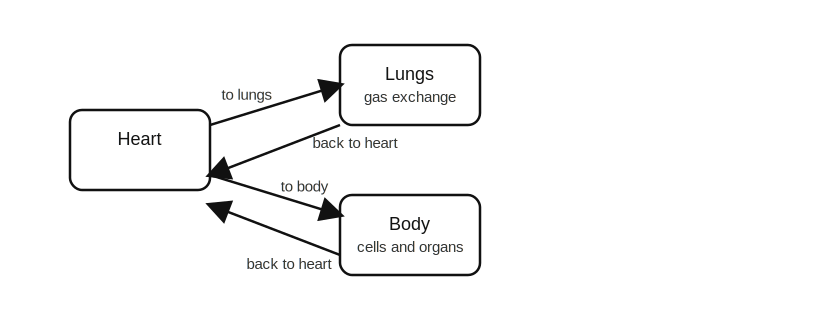
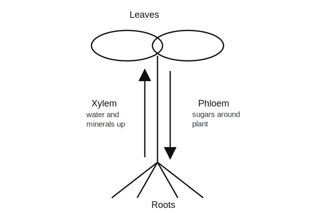
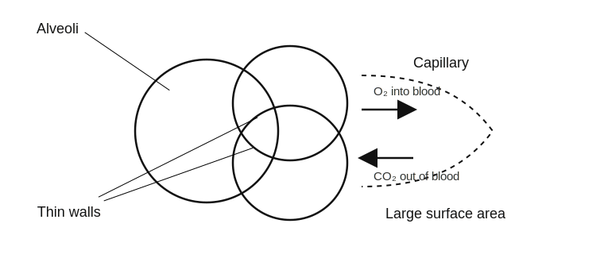

<!-- filename: biology2_organisation.md -->

# GCSEs for Dads – Biology 2: Organisation

You don’t need to memorise every detail at the top.

Get the structure clear first. That’s enough to make most homework questions much easier.

Scroll down to start.

---

## Key Ideas

| Quantity | Key Idea | Meaning |
|----------|----------|---------|
| Cell | Basic unit of life | Smallest part of a living thing |
| Tissue | Similar cells working together | A layer or group with one main job |
| Organ | Different tissues working together | A body part with a specific function |
| Organ system | Organs working together | A larger system that keeps the organism alive |
| Enzyme | Biological catalyst | Speeds up reactions without being used up |

---

## Symbols and Units

| Symbol | Meaning | Unit |
|--------|---------|------|
| O₂ | Oxygen | no unit |
| CO₂ | Carbon dioxide | no unit |
| mm | millimetre | mm |
| cm | centimetre | cm |
| bpm | beats per minute | bpm |

---

# Biology 2: Organisation

---

## 1. The Big Idea (30 seconds)

**In living things, small parts join together into bigger working systems.**

- Cells make tissues  
- Tissues make organs  
- Organs make organ systems  
- Organ systems keep the whole organism alive  

Think of it like this:

One brick does not make a house. One cell does not make a body.

---

## 2. Levels of Organisation

In multicellular organisms, there is a clear order.

- **Cells** → the basic units  
- **Tissues** → groups of similar cells  
- **Organs** → groups of different tissues  
- **Organ systems** → groups of organs  
- **Organism** → the whole living thing  

Example:

- Muscle cells form muscle tissue  
- Muscle tissue is part of the stomach  
- The stomach is part of the digestive system  

**Key idea:**

Each level depends on the one below it.

---

## 3. Animal Tissues

A tissue is a group of similar cells working together.

Three important examples:

- **Muscle tissue**
  - Contracts to create movement

- **Glandular tissue**
  - Makes and releases substances such as enzymes and hormones

- **Epithelial tissue**
  - Covers surfaces and lines organs

Example:

- The stomach contains muscle tissue to churn food
- It also contains glandular tissue to release digestive juices

---

## 4. Organs and Organ Systems

An organ is made from different tissues working together.

Example: the stomach

- Muscle tissue churns food
- Glandular tissue releases enzymes
- Epithelial tissue covers and protects surfaces

An organ system is a group of organs working together.

Example: the digestive system

- Mouth
- Oesophagus
- Stomach
- Small intestine
- Large intestine
- Liver
- Pancreas

**Key idea:**

Organs do not work alone. They are part of larger systems.

---

## 5. The Digestive System

The digestive system breaks large food molecules into smaller ones that can be absorbed into the blood.

Main jobs:

- Break food down
- Absorb useful molecules
- Remove waste

Key parts:

- **Mouth** → starts mechanical digestion
- **Stomach** → churns food and adds digestive juices
- **Small intestine** → where most digestion and absorption happen
- **Large intestine** → absorbs water
- **Liver** → makes bile
- **Pancreas** → makes digestive enzymes

**Key idea:**

Digestion turns food into small soluble molecules that can pass into the blood.

---

## 6. The Heart and Circulatory System

The heart pumps blood around the body.

Humans have a **double circulatory system**:

- Heart → lungs → heart
- Heart → body → heart

That means blood passes through the heart twice in one full circuit.

**Key idea:**

One side sends blood to the lungs. The other sends blood to the rest of the body.

---

## 7. Blood Vessels

There are three main types.

- **Arteries**
  - Carry blood away from the heart
  - Thick, strong walls
  - High pressure

- **Veins**
  - Carry blood back to the heart
  - Have valves
  - Lower pressure

- **Capillaries**
  - Very small
  - Thin walls
  - Allow exchange of substances

**Key idea:**

Arteries carry blood away. Veins carry blood back.

---

## 8. Blood Components

Blood has four main parts.

- **Red blood cells**
  - Carry oxygen
  - Contain haemoglobin

- **White blood cells**
  - Fight infection

- **Platelets**
  - Help blood clot

- **Plasma**
  - Liquid that carries cells, nutrients, hormones, carbon dioxide and urea

**Key idea:**

Blood is a transport system, not just a red liquid.

---

## 9. Plant Organisation

Plants also have tissues, organs and transport systems.

Examples of plant organs:

- **Roots**
  - Absorb water and minerals

- **Stem**
  - Supports the plant
  - Transports substances

- **Leaves**
  - Main site of photosynthesis

Just like in animals, structure matches function.

---

## 10. Transport in Plants

Plants use two transport tissues.

- **Xylem**
  - Moves water and minerals from roots to leaves

- **Phloem**
  - Moves sugars around the plant

**Key idea:**

Xylem mostly moves up. Phloem moves food where it is needed.

---

## 11. The Lungs and Gas Exchange

The lungs are designed for gas exchange.

In the lungs:

- Oxygen moves into the blood
- Carbon dioxide moves out of the blood

This happens in the **alveoli**, which are tiny air sacs.

Alveoli are effective because they have:

- Large surface area
- Thin walls
- Good blood supply

**Key idea:**

The structure of the alveoli makes gas exchange fast.

---

## 12. Enzymes (Introduction)

Enzymes are biological catalysts.

That means:

- They speed up reactions
- They are not used up in the reaction

Examples in digestion:

- **Amylase** breaks down starch
- **Protease** breaks down proteins
- **Lipase** breaks down fats

Each enzyme has a specific shape that matches its substrate.

**Key idea:**

The wrong shape means the enzyme will not work properly.

---

## Common Mistakes

- Mixing up tissues and organs
- Thinking the stomach is a tissue instead of an organ
- Forgetting arteries carry blood away from the heart
- Mixing up xylem and phloem
- Thinking alveoli are the same as the whole lung
- Forgetting enzymes are specific to their substrate

---

## Check Your Understanding

- What is the difference between a tissue and an organ? (A tissue is a group of similar cells, while an organ is made of different tissues working together)
- Why is the stomach an organ and not a tissue? (Because it contains different tissues working together)
- Which blood vessels carry blood away from the heart? (Arteries)
- What is the job of red blood cells? (To carry oxygen)
- What does xylem transport? (Water and minerals)
- Why are alveoli good at gas exchange? (Large surface area, thin walls and good blood supply)
- What is an enzyme? (A biological catalyst that speeds up reactions)

---

## Useful Videos

[Cells, Tissues and Organ Systems](https://youtu.be/MB6mE6weCS4?si=43Xsc14cqs72X2ag)
[Blood](https://youtu.be/wW1NiCQvkDg?si=5s4s02qHSqkMLgnA)
[Lungs and Gas Exchange](https://youtu.be/Nn4ke02sW8Q?si=hFSirijmiE7IXBMf)