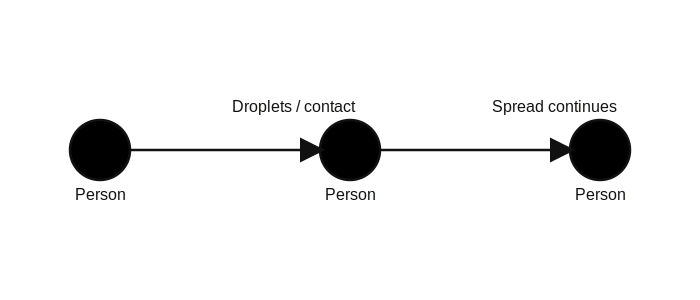
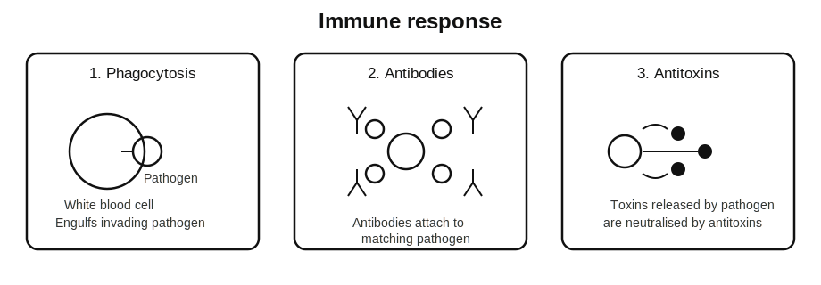
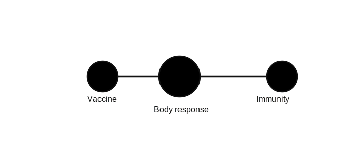
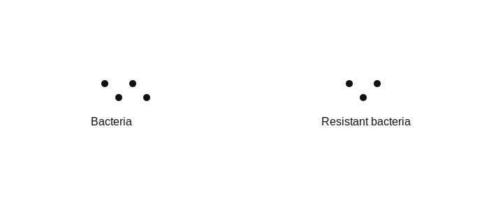

<!-- filename: biology3_infection-and-response.md -->

# GCSEs for Dads – Biology 3: Infection and Response

You don’t need to memorise everything here.

Get the core ideas clear first. That’s enough to handle most questions.

Scroll down to start.

---

## Key Ideas

| Quantity | Key Idea | Meaning |
|----------|----------|---------|
| Pathogen | Causes disease | Microorganism that makes you ill |
| Antibody | Specific defence | Targets a specific pathogen |
| Vaccine | Builds immunity | Prepares the immune system |
| Antibiotic | Kills bacteria | Does not work on viruses |
| Vector | Carries disease | Spreads pathogens between hosts |

---

## Symbols and Units

| Symbol | Meaning | Unit |
|--------|---------|------|
| °C | Temperature | degrees Celsius |
| mm | millimetre | mm |
| μm | micrometre | μm |
| O₂ | Oxygen | no unit |
| CO₂ | Carbon dioxide | no unit |

---

# Biology 3: Infection and Response

---

## 1. The Big Idea (30 seconds)

**Disease is caused by pathogens, and the body has systems to detect and destroy them.**

- Pathogens enter the body  
- The body tries to stop them getting in  
- If they get in, the immune system attacks  
- Medicines and vaccines help  

Think of it like this:

Your body is a security system. Barriers first, then targeted response.

---

## 2. Types of Pathogens

Pathogens are microorganisms that cause disease.

Main types:

- **Bacteria**
  - Living cells
  - Reproduce quickly

- **Viruses**
  - Much smaller
  - Only reproduce inside cells

- **Fungi**
  - Can be multicellular
  - Often infect plants

- **Protists**
  - Single-celled organisms
  - Often spread in water or by vectors

**Key idea:**

Different pathogens behave differently, so they need different treatments.

---

## 3. Bacterial Diseases

Example: **Salmonella**

- Causes food poisoning  
- Spread through contaminated food  

What bacteria do:

- Reproduce quickly  
- Produce toxins that damage cells  

**Key idea:**

Bacteria damage the body directly and through toxins.

---

## 4. Viral Diseases

Example: **Measles**

- Spread by droplets from coughs and sneezes  
- Can cause serious illness  

What viruses do:

- Enter cells  
- Take over the cell  
- Make copies of themselves  

**Key idea:**

Viruses damage cells by using them to reproduce.

---

## 5. Fungal and Protist Diseases

Examples:

- **Fungal:** Rose black spot  
  - Affects plants  
  - Reduces photosynthesis  

- **Protist:** Malaria  
  - Spread by mosquitoes  
  - Affects blood cells  

**Key idea:**

Some diseases are spread by vectors, not direct contact.

---

## 6. How Diseases Spread

Pathogens can spread in different ways:

- Air (droplets from coughing and sneezing)  
- Water or food  
- Direct contact  
- Vectors (e.g. mosquitoes)

**Key idea:**

Breaking the chain of transmission reduces disease spread.

---

## 7. The Body’s First Line of Defence

These stop pathogens getting in:

- Skin → physical barrier  
- Nose hairs and mucus → trap pathogens  
- Stomach acid → kills pathogens  

**Key idea:**

Prevention is easier than fighting infection.

---

## 8. The Immune System

If pathogens enter the body:

White blood cells respond.

They:

- Engulf pathogens (phagocytosis)  
- Produce antibodies  
- Produce antitoxins  

**Key idea:**

Antibodies are specific. Each one targets one pathogen.

---

## 9. Vaccination

Vaccines contain a harmless form of a pathogen.

This causes the body to:

- Produce antibodies  
- Create memory cells  

Next time:

- Faster response  
- Illness prevented or reduced  

**Key idea:**

Vaccines train the immune system before real infection.

---

## 10. Antibiotics and Painkillers

- **Antibiotics**
  - Kill bacteria  
  - Do not work on viruses  

- **Painkillers**
  - Reduce symptoms  
  - Do not kill pathogens  

**Key idea:**

Wrong treatment = no effect.

---

## 11. Antibiotic Resistance

Overuse of antibiotics can lead to resistance.

What happens:

- Some bacteria survive  
- They reproduce  
- The population becomes resistant  

**Key idea:**

Antibiotics become less effective over time if overused.

---

## 12. Drug Development

Steps:

- Discovery  
- Testing (lab and clinical trials)  
- Approval  

Drugs must be:

- Safe  
- Effective  
- Correct dosage  

**Key idea:**

New drugs take years to develop.

---

## Common Mistakes

- Thinking antibiotics work on viruses  
- Mixing up bacteria and viruses  
- Forgetting antibodies are specific  
- Not understanding how vaccines work  
- Ignoring how diseases spread  

---

## Check Your Understanding

- What is a pathogen? (A microorganism that causes disease)  
- Why don’t antibiotics work on viruses? (They only target bacteria)  
- What do antibodies do? (Target specific pathogens)  
- How do vaccines work? (Train the immune system using a harmless form)  
- What is a vector? (An organism that spreads disease)  
- Why is antibiotic resistance a problem? (Bacteria become harder to kill)  

---

## Useful Videos

- https://www.youtube.com/watch?v=Q4Yl0vLr4Qk  
- https://www.youtube.com/watch?v=3GZ8aYvX0zA  
- https://www.youtube.com/watch?v=5q9p5L8bWn8  