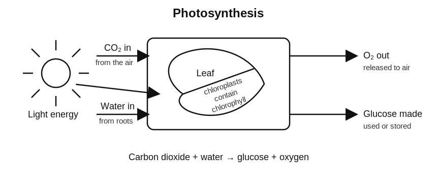
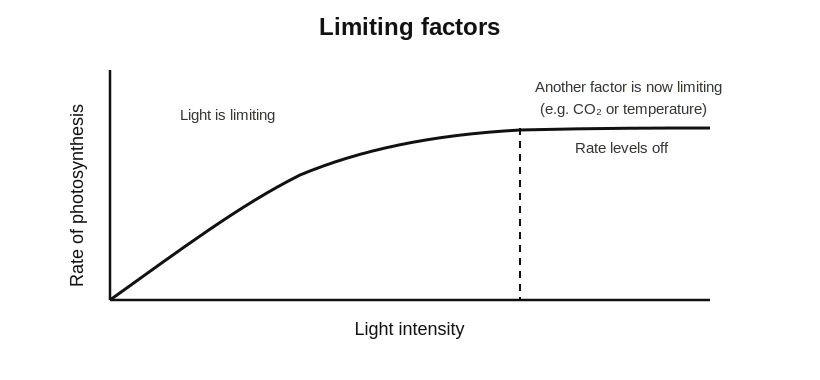
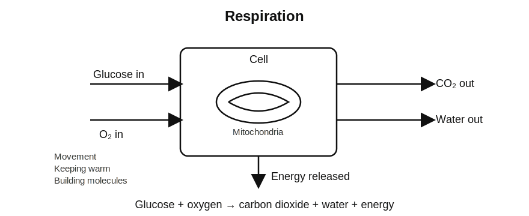

<!-- filename: biology4_bioenergetics.md -->

# GCSEs for Dads – Biology 4: Bioenergetics

You don’t need to memorise every equation straight away.

Get the flow of energy clear first. That’s what most questions are testing.

Scroll down to start.

---

## Key Ideas

| Quantity | Key Idea | Meaning |
|----------|----------|---------|
| Photosynthesis | Energy in | Plants make glucose using light |
| Respiration | Energy out | Cells release energy from glucose |
| Limiting factor | Controls rate | The factor in shortest supply |
| Aerobic respiration | With oxygen | Releases lots of energy |
| Anaerobic respiration | Without oxygen | Releases less energy |

---

## Symbols and Units

| Symbol | Meaning | Unit |
|--------|---------|------|
| CO₂ | Carbon dioxide | no unit |
| O₂ | Oxygen | no unit |
| °C | Temperature | degrees Celsius |
| s | Time | seconds |
| min | Time | minutes |

---

# Biology 4: Bioenergetics

---

## 1. The Big Idea (30 seconds)

**Living things need a constant flow of energy, and this comes from photosynthesis and respiration.**

- Plants store energy using photosynthesis  
- Cells release energy using respiration  
- Energy is needed for movement, growth and keeping warm  

Think of it like this:

Photosynthesis charges the battery. Respiration uses it.

---

## 2. Photosynthesis

Photosynthesis is how plants make glucose.

Word equation:

- Carbon dioxide + Water → Glucose + Oxygen  

Requirements:

- Light  
- Chlorophyll  
- Carbon dioxide  
- Water  

**Key idea:**

Light energy is converted into chemical energy in glucose.

---

## 3. What Happens to Glucose

Glucose made in photosynthesis is used in several ways:

- Respiration  
- Stored as starch  
- Used to make cellulose (cell walls)  
- Used to make amino acids (growth)  

**Key idea:**

Glucose is not just food. It is a building material.

---

## 4. Factors Affecting Photosynthesis

It doesn't just increase forever. It levels off eventually.

Three main factors:

- **Light intensity**
  - More light → faster rate (until it levels off)

- **Carbon dioxide concentration**
  - More CO₂ → faster rate  

- **Temperature**
  - Higher → faster (up to optimum)
  - Too high → enzymes denature  

**Key idea:**

The limiting factor controls the rate.

---

## 5. Limiting Factors (Quick Logic)

- Only one factor limits the rate at a time  
- Increasing other factors has no effect  

Example:

- High light but low CO₂ → CO₂ is limiting  

---

## 6. Respiration

Respiration releases energy from glucose.

Word equation:

- Glucose + Oxygen → Carbon dioxide + Water  

**Key idea:**

Respiration happens in all living cells.

---

## 7. Aerobic Respiration

- Uses oxygen  
- Releases a large amount of energy  

Used for:

- Movement (Walking, Jogging, Swimming Slowly)  
- Keeping warm  
- Building molecules  

**Key idea:**

More oxygen = more energy released.

---

## 8. Anaerobic Respiration

Happens when there is not enough oxygen.

### In animals:

- Glucose → Lactic acid  

### In plants and yeast:

- Glucose → Ethanol + Carbon dioxide  

**Key idea:**

Anaerobic respiration releases less energy.

---

## 9. Exercise and Oxygen Debt

During hard exercise (sprinting, swimming hard):

- Oxygen supply cannot keep up  
- Anaerobic respiration occurs  

After exercise:

- Extra oxygen is needed  
- Lactic acid is removed  

**Key idea:**

This extra oxygen needed is called oxygen debt.

---

## 10. Metabolism

Metabolism is all the chemical reactions in the body.

Includes:

- Respiration  
- Photosynthesis (in plants)  
- Making new molecules  

Examples:

- Converting glucose to starch  
- Making proteins from amino acids  

**Key idea:**

Metabolism keeps organisms alive.

---

## 11. Photosynthesis Required Practical

Typical setup:

- Pondweed in water  
- Lamp provides light  
- Count oxygen bubbles  

What you change:

- Light intensity (distance of lamp)  

What you measure:

- Rate of photosynthesis  

**Key idea:**

More bubbles = faster photosynthesis.

---

## Common Mistakes

- Mixing up photosynthesis and respiration  
- Forgetting photosynthesis needs light  
- Thinking limiting factors work together (only one limits at a time)  
- Forgetting anaerobic respiration releases less energy  
- Mixing up products of respiration and photosynthesis  

---

## Check Your Understanding

- What is photosynthesis? (Using light energy to make glucose)  
- Name one limiting factor (Light / CO₂ / Temperature)  
- What is respiration? (Releasing energy from glucose)  
- What is produced in anaerobic respiration in muscles? (Lactic acid)  
- Why does photosynthesis slow down at high temperature? (Enzymes denature)  
- What is oxygen debt? (Extra oxygen needed after exercise)  

---

## Useful Videos

[Photosynthesis](https://youtu.be/cucQtak-jco?si=pnMg12g7AFIRFqGL)
[Aerobic and Anaerobic Respiration](https://youtu.be/xzDAZUZido0?si=SsbI6Pky--AG78Eq)

