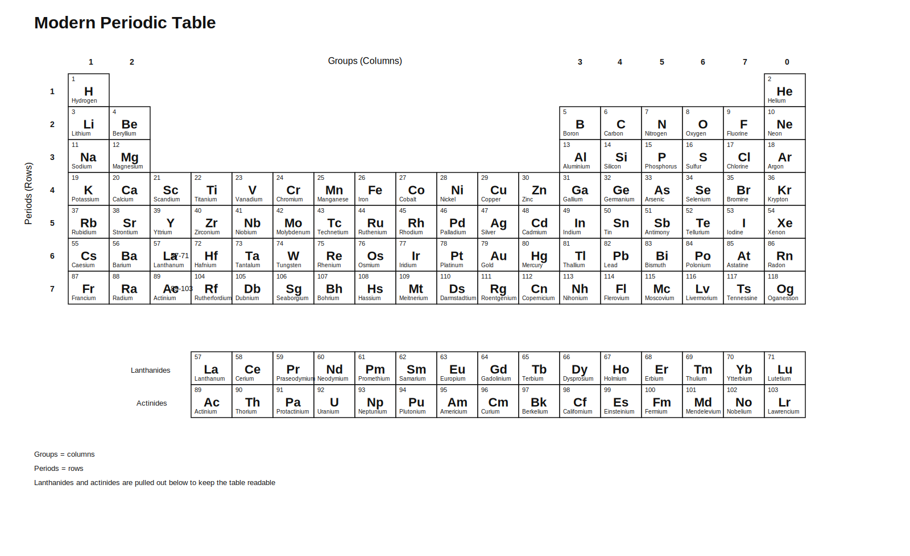
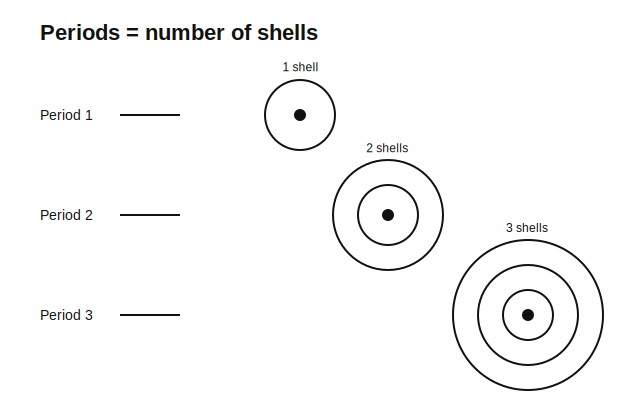
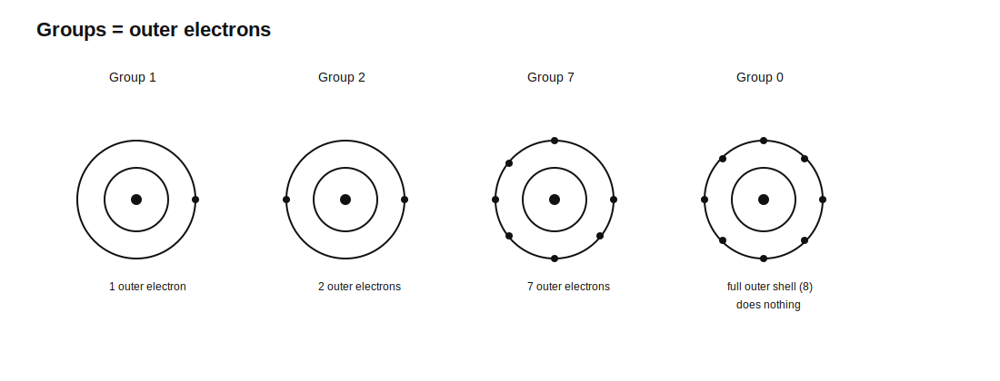
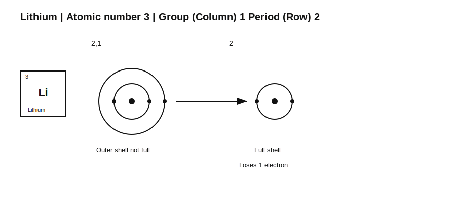
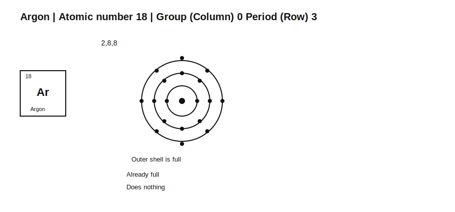
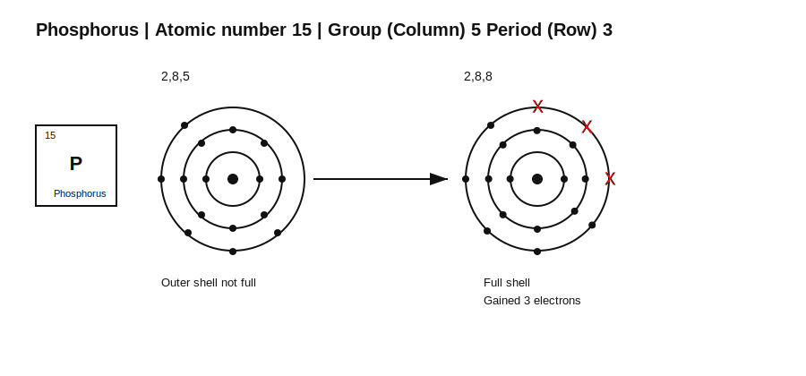

# GCSEs for Dads – Chemistry 0: How to Read the Periodic Table

**Before we go anywhere else, I'm going to change your life. Or at least the bit involving the periodic table.**

This is the simple version. The one that actually helps.

You do **not** need to memorise the whole periodic table.  
You just need to know how to read it.

The number in each box is the atomic number.

That tells you how many protons and electrons the atom has.

---

# Chemistry 0: How to Read the Periodic Table

## 1. The Big Idea (30 seconds)

- The periodic table looks confusing until you know what the rows and columns mean  
- Once you know how shells fill up, you can work out what an atom will do  
- That means you can predict bonding instead of just memorising it  
- This is one of the most useful shortcuts in chemistry  

---

## 2. What the Numbers Mean

Before you worry about rows and columns, you need to know how to read one box.

Each box in the periodic table shows:

- Atomic number  
- Element symbol  
- Element name  

The atomic number is the important one.

- Atomic number = number of protons  
- In a neutral atom, number of electrons = number of protons  

So:

- Atomic number 3 → 3 protons → 3 electrons  

That is how we work out electron arrangement.

Example:

- Atomic number 3  
- 3 electrons  
- Fill the shells: 2,1  

Mass number is different:

- Mass number = protons + neutrons  

You do not need this much yet, but it matters later.

#### The key idea

- Protons tell you what the element is  
- Electrons help tell you how it behaves  

---

## 3. What Rows and Columns Mean

Firstly:

- Periods (rows in the table) tell you how many shells there are  

- Groups (columns in the table) tell you how many electrons are in the outer shell  

Read that twice. This is the bit that makes everything easier.

---

## 4. The Main Rule

- First shell holds 2 electrons  
- Every other shell holds 8 (for GCSE level)  

So you fill shells like this:

- 2, then 8, then 8  

until you run out of electrons.

---

## 5. What Happens Next

- If the outer shell is full, the atom does nothing  
- If the outer shell is not full, the atom reacts  

To become stable:

- If the outer shell has 1, 2 or 3 electrons → it will usually lose electrons  
- If the outer shell has 5, 6 or 7 electrons → it will usually gain electrons  
- If it has 4 → it usually shares electrons  

---

## 6. Worked Examples

### Atomic number 3

- Fill the shells: 2,1  
- Outer shell is not full  
- Easiest route → lose 1 electron  

So:

- 2,1  
- Reacts  
- Loses 1 electron  

---

### Atomic number 18

- Fill the shells: 2,8,8  
- Outer shell is full  

So:

- 2,8,8  
- Already stable  
- Does nothing  

---

### Atomic number 15

- Fill the shells: 2,8,5  
- Outer shell is not full  
- Easiest route → gain 3 electrons  

So:

- 2,8,5  
- Reacts  
- Gains 3 electrons  

---

## 7. The Key Idea

- Fill 2, then 8s  
- If the outer shell is full, it does nothing  
- If it is not full, do the easiest thing to make it full  

That is basically the whole game.

---

## 8. Check Your Understanding

- What does atomic number tell you? ( number of protons )  
- In a neutral atom, how many electrons are there? ( same as protons )  
- What do periods (rows) tell you? ( how many shells there are )  
- What do groups (columns) tell you? ( how many electrons are in the outer shell )  
- If an atom has one shell, when is it full? ( 2 )  
- If an atom has more than one shell, when is the outer shell full? ( 8 )  
- What happens if the outer shell is not full? ( it reacts )  
- If the outer shell has 2 electrons, what will usually happen? ( lose 2 )  
- If the outer shell has 7 electrons, what will usually happen? ( gain 1 )  

---

## 9. Why This Matters

You will read about bonding next.

What we now know:

- shells contain electrons  
- atoms react when the outer shell is not full  
- bonding is just atoms trying to fix that  

That makes the next chapter much easier.

---

## 10. Useful Videos

- [Atomic Structure](https://youtu.be/GTpo1nAZqFE?si=sas08r1QnP1GJayL)
- [The Periodic Table](https://youtu.be/GTpo1nAZqFE?si=sas08r1QnP1GJayL)
- [Ionic Bonding](https://youtu.be/8Altqj4qbP0)