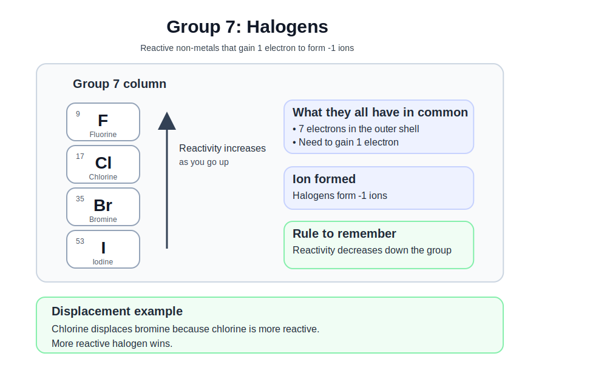

# GCSEs for Dads – Chemistry 1: Atomic Structure and the Periodic Table

**Don’t worry about reading the formulas now. Just know they’re here at the top if you need them. Scroll down to start.**

You don’t need to memorise these straight away. Just get familiar with what they look like.

---

## Atomic Structure and Periodic Table – Key Ideas

| Quantity | Key Idea | Meaning |
|----------|----------|---------|
| Atomic number | Number of protons | Defines the element |
| Mass number | Protons + neutrons | Total particles in nucleus |
| Relative atomic mass (Ar) | Weighted average | Accounts for isotopes |
| Electron shells | Energy levels | Where electrons sit around nucleus |

## Symbols and Units

| Symbol | Meaning | Unit |
|--------|---------|------|
| p⁺ | Proton | no unit |
| n⁰ | Neutron | no unit |
| e⁻ | Electron | no unit |
| Z | Atomic number | no unit |
| A | Mass number | no unit |
| Ar | Relative atomic mass | no unit |

---

# Chemistry 1: Atomic Structure and the Periodic Table

## 1. The Big Idea (30 seconds)

- Everything is made of atoms  
- Atoms are tiny particles with a nucleus in the centre and electrons around the outside  
- The periodic table organises all elements based on their structure and properties  
- If you understand how atoms are built, the rest of chemistry starts to make sense  

---

## 2. Structure of the Atom

Atoms are made of three main particles:

- Protons  
- Neutrons  
- Electrons  

| Particle | Charge | Relative Mass | Location |
|----------|--------|---------------|----------|
| Proton | +1 | 1 | Nucleus |
| Neutron | 0 | 1 | Nucleus |
| Electron | -1 | very small | Shells around nucleus |

Key points:

- The nucleus is very small but contains most of the mass  
- Electrons move around the nucleus in shells  
- Most of the atom is empty space  

---

## 3. Atomic Number and Mass Number

Atomic number (Z):

- Number of protons  
- Defines the element  
- Also equals number of electrons in a neutral atom  

Mass number (A):

- Protons + neutrons  

Example:

- Carbon has 6 protons  
- Carbon has 6 neutrons  
- Carbon has 6 electrons  

So:

- Atomic number = 6  
- Mass number = 12  

---

## 4. Electron Shells

Electrons sit in shells around the nucleus.

Think of shells like layers.

- First shell holds up to 2 electrons  
- Second shell holds up to 8 electrons  
- Third shell holds up to 8 electrons (for GCSE level)  

Example:

- Oxygen has 8 electrons  
- 2 in first shell  
- 6 in second shell  

Key idea:

- The outer shell controls how atoms react  

---

## 5. The Periodic Table

The periodic table is arranged by atomic number.

- Each element is placed in order of increasing number of protons  

Rows = periods  
Columns = groups  

Key ideas:

- Elements in the same group have similar properties  
- They have the same number of outer shell electrons  

---

## 6. Groups You Must Know (GCSE Core)

These are the three groups that come up again and again.

Group 1 (alkali metals):

- Lose 1 electron → form +1 ions  
- Very reactive  
- Reactivity increases down the group  

Group 7 (halogens):

- Gain 1 electron → form -1 ions  
- Reactive non-metals  
- Reactivity decreases down the group  

Group 0 (noble gases):

- Full outer shell  
- Very unreactive  
- Exist as single atoms  

#### The key idea (this is the line to remember)

- Group 1 loses  
- Group 7 gains  
- Group 0 does nothing  

---

## 7. Group 7 (Halogens) – What You Actually Need for Questions

- Halogens are reactive non-metals  
- They exist as diatomic molecules (Cl₂, Br₂, etc.)

### Reactivity trend

- Reactivity decreases down the group  
  - This is because you have more shells so it's further away from the positive nucleus
- Top = most reactive  
- Bottom = least reactive  
- Fluorine → Chlorine → Bromine → Iodine  

### Displacement reactions

- A more reactive halogen displaces a less reactive halogen from a compound  

Example:

- Chlorine displaces bromine  

Rule to remember:

- More reactive halogen wins  

---

## 8. Isotopes

Isotopes are atoms of the same element with different numbers of neutrons.

This took me a while to get into my head too. Chemistry is so abstract. Hopefully this explains it. 

### Isotopes are just different versions of the same element

Example: Lithium

- Lithium-6, Lithium-7, Lithium-8  
- All lithium → all have 3 protons  
- The number of neutrons is different  

Think of it like golf clubs:

- 1 wood, 3 wood, 5 wood  
- All woods  
- Slightly different versions  

Simple summary:

- The periodic table shows **one box per element**  
- That box does **not show a single atom**  
- It shows an **average of all versions of that element**  

Example: Lithium

- Lithium-6 → 3 protons, 3 neutrons  
- Lithium-7 → 3 protons, 4 neutrons  

The number on top ≈ 7  

- That “7” is **not Lithium-7 specifically**  
- It means most lithium atoms are around mass 7  

The versions are called isotopes  

---

## The key idea (this is the line to remember)

- Same number of protons = same element  
- Different number of neutrons = different isotope  

#### One-line version (for exams)

- Isotopes are atoms of the same element with the same number of protons but different numbers of neutrons  

---

## 9. Development of the Periodic Table

Early scientists tried to organise elements by properties.

Dmitri Mendeleev played a key role.

- He arranged elements by mass  
- He left gaps for unknown elements  
- His predictions were later proven correct  

Modern periodic table:

- Arranged by atomic number (protons)  
- This fixes earlier inconsistencies  

---

## 10. Check Your Understanding

- What is the charge of a proton? ( +1 )  
- Which particle has almost no mass? ( electron )  
- What is atomic number? ( number of protons )  
- What is the outer shell responsible for? ( chemical reactions )  
- What is an isotope? ( same element, different neutrons )  
- Which group contains the alkali metals? ( Group 1 )  
- Which group contains the halogens? ( Group 7 )  
- Which group is very unreactive? ( Group 0 )  

---

## 11. Useful Videos

- [Atomic Structure](https://youtu.be/GTpo1nAZqFE?si=sas08r1QnP1GJayL)  

- [The Periodic Table](https://youtu.be/NVnnIjUbXNQ?si=rRuXmgDTherAi-Of) 

- [Isotopes](https://youtu.be/GTpo1nAZqFE?si=l_n4wTu8JAjJBGXT)  

- [Group 7 and 0 Elements](https://youtu.be/uYubwlPRdCs?si=s9K9EkHHFEtGv6ys)