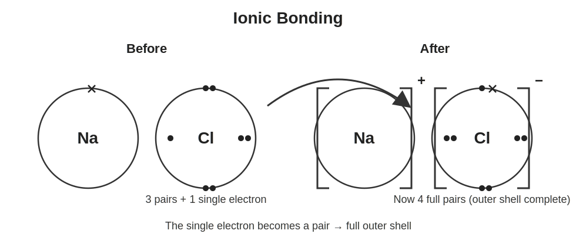
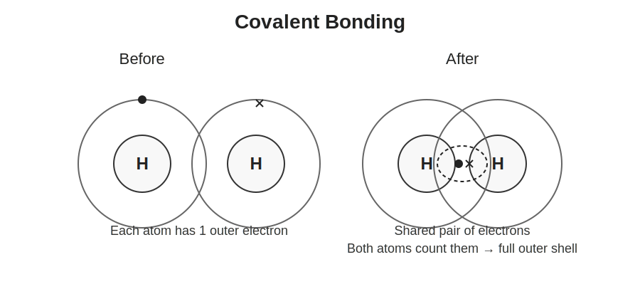
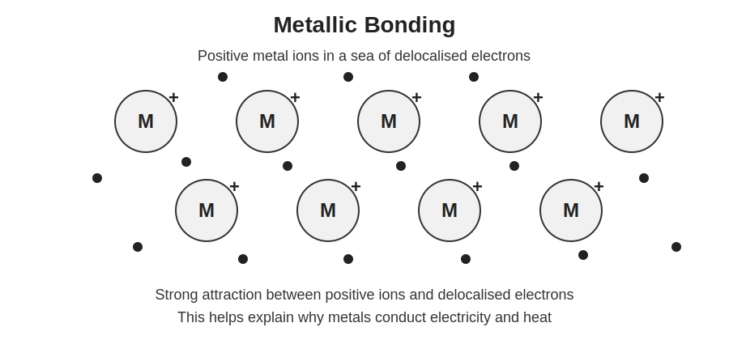

<!-- filename: chemistry2_bonding-structure-and-properties.md -->

# GCSEs for Dads – Chemistry 2: Bonding, Structure and the Properties of Matter

**Don’t worry about reading the formulas now. Just know they’re here at the top if you need them. Scroll down to start.**

You don’t need to memorise these straight away. Just get familiar with what they look like.

---

## Bonding and Structure – Key Ideas

| Quantity | Key Idea | Meaning |
|----------|----------|---------|
| Ionic bonding | Transfer of electrons | Forms charged ions |
| Covalent bonding | Sharing electrons | Forms molecules |
| Metallic bonding | Sea of electrons | Explains conductivity |
| Intermolecular forces | Weak attractions | Affect boiling/melting points |

## Symbols and Units

| Symbol | Meaning | Unit |
|--------|---------|------|
| e⁻ | Electron | no unit |
| + | Positive ion | no unit |
| - | Negative ion | no unit |
| Na⁺ | Sodium ion | no unit |
| Cl⁻ | Chloride ion | no unit |

---

# Chemistry 2: Bonding, Structure and the Properties of Matter

Before we start, the videos linked below are really useful. You will definitely want to read this and watch them and then it should be clear. 

## 1. The Big Idea (30 seconds)

**Atoms bond to get a full outer electron shell.**

...That’s it. That’s the whole game.

- Atoms are most stable when their outer shell is full
- If it’s not full, they will try to fix that
- They do this by losing, gaining, or sharing electrons

Think of it like this

- Outer shell not full → unstable → reacts
    - Reacts just means "The atom rearranges its electrons so it can get a full outer shell"
- Outer shell full → stable → happy to stay as it is

The type of bonding controls the properties of a substance  
- There are three main types: 
    - ionic
    - covalent
    - metallic  
- Structure explains things like melting point, strength, and conductivity  

---

## Before we go anywhere else I'm going to change your life (in as far as understanding the periodic table goes)

You will read about bonding in a minute. What we know from chapter 1 is that there are shells around the atom. The shells contain electrons. 

This following bit will explain the simple rules on how to read these from the periodic table and how to calculate what will happen. 

## The Simplest Way to Read the Periodic Table

Firstly, 
- Periods (rows in the table) just mean how many shells (rings on the diagram) there are. It's worth remembering this.
- Groups (columns) just means how many electrons are in the outer shell

Read that twice, or until you get it because that is a big clue. Then...

- The main rule
    - If an atom has one shell, it’s full at 2. 
    - If it has more shells, the outer one is full at 8. 
    - Say it with me. First shell 2, every other shell 8. Not very catchy but whatevs  

- So you have to fill the shells like this. 2 then next one is 8 then the one after is 8 until you get to one that isn't full.  

- If the outer shell isn't 8 (or 2 in the case of only one shell) it will react which just means it bonds with another atom.   

- Then if it will react, just take the easiest route to a complete shell (add or remove electrons)  

So...

- If the outer shell is 1,2 or 3 you need to remove electrons.  
- If it's 5,6 or 7 then you need to add electrons.  
- (If it's 4 then it usually shares, so just park that for now)

## 2. Ionic Bonding

Ionic bonding happens between metals and non-metals.

- Metals lose electrons → form positive ions  
- Non-metals gain electrons → form negative ions  
- Opposite charges attract  

Example:

- Sodium (Na) loses 1 electron → Na⁺  
- Chlorine (Cl) gains 1 electron → Cl⁻  

Key idea:

- Ionic compounds form a giant lattice structure  

Properties:

- High melting and boiling points  
- Conduct electricity when molten or dissolved  
- Usually brittle  

---

## 3. Covalent Bonding

Covalent bonding happens between non-metals.

- Atoms share pairs of electrons  
- This allows both atoms to fill their outer shells  

Examples:

- Hydrogen (H₂)  
- Oxygen (O₂)  
- Water (H₂O)  

Types of covalent structures:

Simple molecules:

- Small, discrete molecules  
- Weak forces between molecules  

Properties:

- Low melting and boiling points  
- Do not conduct electricity  

Giant covalent structures:

- Large networks of atoms  

Examples:

- Diamond  
- Graphite  

Properties:

- Very high melting points  
- Usually do not conduct electricity (except graphite)  

---

## 4. Metallic Bonding

Metallic bonding occurs in metals.

- Positive metal ions in a lattice  
- Surrounded by a “sea” of delocalised electrons  

Key idea:

- Electrons are free to move  

Properties:

- Good conductors of electricity and heat  
- Strong but malleable (can be shaped)  
- High melting points  

---

## 5. States of Matter and Structure

The structure of a substance affects its state.

Solids:

- Particles closely packed  
- Vibrate in place  

Liquids:

- Particles close but can move past each other  

Gases:

- Particles far apart and move freely  

Changes of state:

- Melting  
- Boiling  
- Condensing  
- Freezing  

---

## 6. Intermolecular Forces

These are forces between molecules (not bonds inside them).

- Much weaker than covalent or ionic bonds  

Key idea:

- They control melting and boiling points of simple molecules  

Example:

- Water has stronger intermolecular forces than methane  
- So water has a higher boiling point  

---

## 7. Polymers (Brief Overview)

Polymers are long chains of repeating units.

- Made from small molecules called monomers  

Examples:

- Plastics  

Key idea:

- Structure affects flexibility, strength, and melting point  

---

## 8. Check Your Understanding

- What type of bonding involves electron transfer? ( ionic )  
- What type of bonding involves sharing electrons? ( covalent )  
- Why do metals conduct electricity? ( free electrons )  
- Why do simple molecules have low boiling points? ( weak intermolecular forces )  
- What structure do ionic compounds form? ( giant lattice )  

---

## 9. Useful Videos

- [Ionic Bonding](https://youtu.be/MdU44WeiLps?si=vzUIciGdqQ8twSBo)

- [Covalent Bonding](https://youtu.be/7IkYm7ZgiAw?si=tXp6Xcv9oNcBVcPB)    

- [Metallic Bonding](https://youtu.be/tRKkGRBndto?si=SqhBR9tczKQrc9at) 