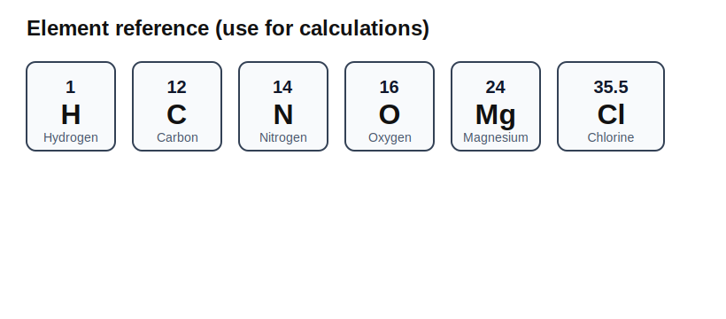
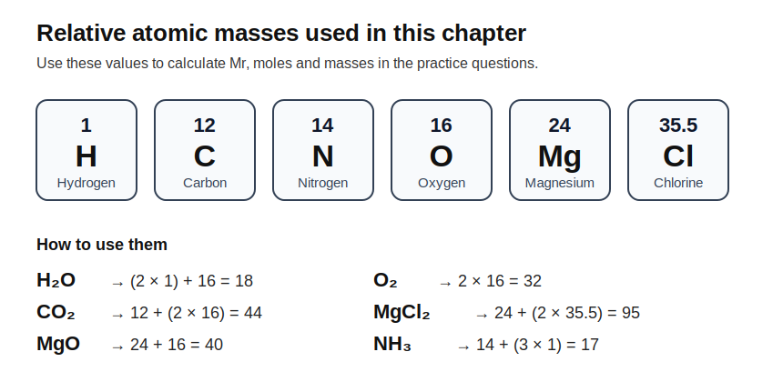

<!-- filename: chemistry3_quantitative-chemistry.md -->

# GCSEs for Dads – Chemistry 3: Quantitative Chemistry

**Don’t worry about reading the formulas now. Just know they’re here at the top if you need them. Scroll down to start.**

You don’t need to memorise these straight away. Just get familiar with what they look like.

---

## Quantitative Chemistry – Key Ideas

| Quantity | Formula | Meaning |
|----------|---------|---------|
| Relative formula mass (Mr) | sum of Ar values | Total mass of a compound |
| Moles | moles = mass ÷ Mr | Amount of substance |
| Concentration | conc = mass ÷ volume | How much is dissolved |
| Percentage yield | (actual ÷ theoretical) × 100 | Efficiency of reaction |

In the exam you need to remember **mass = moles × Mr**

## Symbols and Units

| Symbol | Meaning | Unit |
|--------|---------|------|
| Ar | Relative atomic mass | no unit |
| Mr | Relative formula mass | no unit |
| n | Number of moles | mol |
| m | Mass | g |
| V | Volume | cm³ or dm³ |
| % | Percentage | % |

1 mole = (6.02 × 10²³) particles (Avogadro’s number. All sounds a bit Harry Potter really)

---

# Chemistry 3: Quantitative Chemistry

Before we start..Every GCSE question follows the same steps:

- Work out Mr
- Convert to moles
- Use the ratio
- Convert back

If you stick to the method, this becomes one of the easiest topics to score marks on.

## 1. The Big Idea (30 seconds)

**A mole is just a way of counting atoms or molecules in a practical way.** 1 mole is just a fixed number of particles (see above)

- Chemistry is not just what reacts, but how much reacts  
- Moles are used to count particles in a practical way  
- Balanced equations let you calculate amounts  

This is where maths comes into chemistry. A practical tip, one that I've learned along the years, practising calculations will make this sink in. Sorry, sometimes you just need to get down to it.   

These elements are used in the examples below.

---
## 2. Relative Formula Mass (Mr)

This is the total mass of a compound.

- Add up all the relative atomic masses (Ar)  

Example:

- CO₂  
- C = 12  
- O = 16 × 2  

- Mr = 12 + 32 = 44  

Key idea:

- Mr tells you the mass of one mole of a substance

---

## 3. The Mole

A mole is a standard unit for counting particles.

- 1 mole = a fixed number of particles  

You do not need the actual number for GCSE.

Formula:

- moles = mass ÷ Mr  

Example:

- Mass = 44 g  
- Mr = 44  

- Moles = 1  

---

## 4. Balanced Equations

Equations must be balanced to conserve mass.

Example:

- 2H₂ + O₂ → 2H₂O  

This means:

- 2 moles of hydrogen react with 1 mole of oxygen  
- Produces 2 moles of water  

Key idea:

- The numbers in front give mole ratios  

---

## 5. Using Moles in Calculations

Steps:

- Write the balanced equation  
- Calculate moles of known substance  
- Use ratio from equation  
- Convert back to mass if needed  

Example (simple idea):

- If 1 mole of A reacts with 1 mole of B  
- Then amounts are equal in moles  

---

## 6. Concentration

Used for solutions.

Formula:

- concentration = mass ÷ volume  

Units:

- g/dm³  

Example:

- 10 g dissolved in 2 dm³  

- concentration = 5 g/dm³  

---

## 7. Percentage Yield

Not all reactions are perfect.

Formula:

- percentage yield = (actual ÷ theoretical) × 100  

Key idea:

- Theoretical = expected amount  
- Actual = what you actually get  

Reasons for low yield:

- Reaction incomplete  
- Product lost during transfer  
- Side reactions  

#### 7.1. Atom Economy (Higher Tier concept, but useful)

Measures how much useful product is made.

- High atom economy = less waste  

Key idea:

- Important in industry  

---

## 8. Check Your Understanding

- What is Mr? ( total mass of compound )  
- What is a mole used for? ( counting particles )  
- What must equations be? ( balanced )  
- What does percentage yield measure? ( efficiency )  
- What unit is concentration in? ( g/dm³ )  

---

## 9. Useful Videos

[Moles Explained](https://youtu.be/kBlmEfS_P00?si=1dWFcJvvR0zPtOQy)

[Calculating Moles](https://youtu.be/MEQ1YGxfAQ4?si=S4PxKEy23ZjTA4Ow)

[Percentage Yield](https://youtu.be/DIird9oZVII?si=eZVdMydYLYtzWboT)

Use the above diagram to work through these

## 9. Practice Calculations

Try these without looking at the answers first.

1. Calculate the relative formula mass (Mr) of H₂O.  
(2 × 1) + 16 = **18**

2. Calculate the relative formula mass (Mr) of CO₂.  
12 + (2 × 16) = **44**

3. Calculate the relative formula mass (Mr) of MgO.  
24 + 16 = **40**

4. Calculate the number of moles in 24 g of magnesium oxide (MgO).  
Moles = mass ÷ Mr = 24 ÷ 40 = **0.6 mol**

5. Calculate the number of moles in 36 g of water (H₂O).  
Moles = mass ÷ Mr = 36 ÷ 18 = **2 mol**

6. Calculate the mass of 0.5 mol of carbon dioxide (CO₂).  
Mass = moles × Mr = 0.5 × 44 = **22 g**

7. Calculate the mass of 3 mol of oxygen molecules (O₂).  
Mr of O₂ = 2 × 16 = 32  
Mass = 3 × 32 = **96 g**

8. Calculate the number of moles in 11 g of carbon dioxide (CO₂).  
Moles = mass ÷ Mr = 11 ÷ 44 = **0.25 mol**

9. In the equation:  
2H₂ + O₂ → 2H₂O  
How many moles of water are made from 3 mol of oxygen?  
1 mol O₂ makes 2 mol H₂O  
So 3 mol O₂ makes **6 mol H₂O**

10. In the equation:  
Mg + 2HCl → MgCl₂ + H₂  
How many moles of hydrochloric acid are needed to react completely with 4 mol of magnesium?  
1 mol Mg needs 2 mol HCl  
So 4 mol Mg needs **8 mol HCl**