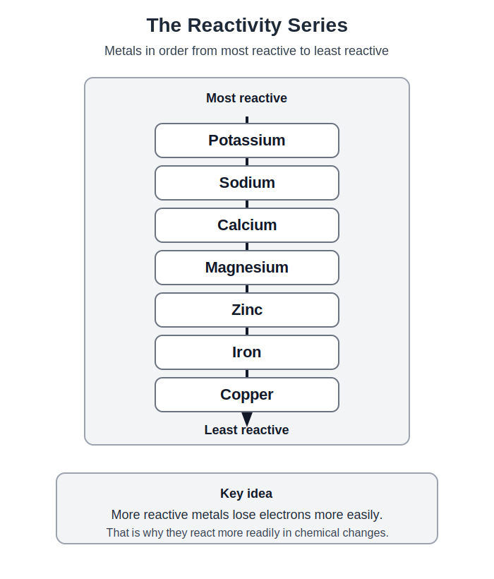
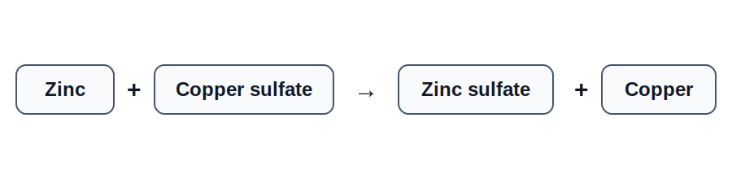
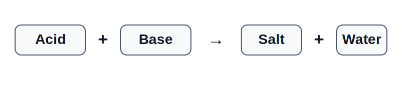
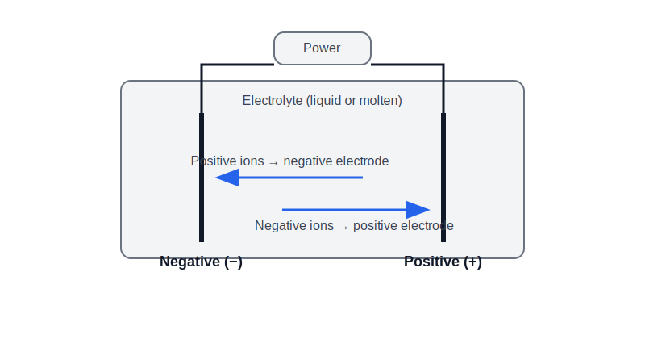

<!-- filename: chemistry4_chemical-changes.md -->

# GCSEs for Dads – Chemistry 4: Chemical Changes

**Don’t worry about reading the formulas now. Just know they’re here at the top if you need them. Scroll down to start.**

You don’t need to memorise these straight away. Just get familiar with what they look like.

---

## Chemical Changes – Key Ideas

## Chemical Changes – Key Ideas

| Idea | What it means |
|------|--------------|
| Reactivity | How easily a metal reacts |
| pH scale | A scale from 0–14 showing how acidic or alkaline a substance is |
| Electrolysis | Using electricity to break down a compound |
| Displacement | A more reactive metal replaces a less reactive one in a compound |

## Symbols

| Symbol | Meaning |
|--------|---------|
| H⁺ | Hydrogen ion |
| OH⁻ | Hydroxide ion |
| (aq) | Aqueous (dissolved) |
| (s) | Solid |
| (l) | Liquid |
| (g) | Gas |

---

# Chemistry 4: Chemical Changes

## 1. The Big Idea (30 seconds)

- Chemical reactions involve new substances being formed  
- Metals react in predictable ways based on reactivity  
- Acids, bases, and salts are key parts of chemistry  
- Some reactions use electricity to split compounds  

---

## 2. The Reactivity Series

Metals can be placed in order of reactivity.

Key idea:

- More reactive metals lose electrons more easily  

---

## 3. Displacement Reactions

### Displacement Reactions (making sense of it)

A more reactive metal will **push out** a less reactive metal from a compound.

Think of it like this:
- The compound is already “holding” a metal
- A stronger (more reactive) metal comes along
- It takes that metal’s place

---

### Example

What’s happening step by step:

- Copper sulfate is a compound containing copper
- Zinc is added to the solution
- Zinc is **more reactive than copper**
- So zinc takes copper’s place in the compound
- Copper gets kicked out as a solid metal

---

#### What you would actually see

- The blue solution (copper sulfate) starts to fade
- A reddish-brown solid (copper) appears
- Zinc slowly dissolves into the solution

---

#### Key idea

More reactive metal wins.

If the metal you add is **higher in the reactivity series**, it will displace the metal in the compound.

If it’s lower, **nothing happens**.

---

## 4. Acids and Alkalis

Acids (for example Hydrochloric acid, Sulphuric acid):

- Release H⁺ ions (Hydrogen Ions) in solution  

Alkalis (Sodium hydroxide, Potassium hydroxide):

- Release OH⁻ ions (Hydroxide ion) in solution  

Key idea:

- Acids and alkalis neutralise each other  

---

## 5. The pH Scale

The pH scale measures how acidic or alkaline a substance is.

- pH 0–6 = acidic  
- pH 7 = neutral  
- pH 8–14 = alkaline  

Key idea:

- Lower pH = more acidic  
- Higher pH = more alkaline  

---

## 6. Neutralisation (what’s actually going on)

Neutralisation is when an **acid cancels out a base**.

---

#### What are acids and bases doing?

- Acids contain **H⁺ ions** (hydrogen ions)  
- Bases (like alkalis) contain **OH⁻ ions** (hydroxide ions)  

These are the parts that actually react.

---

#### The important bit (this is the whole game)

H⁺ + OH⁻ → H₂O  

**That’s it!**

A hydrogen ion and a hydroxide ion combine to make **water**.

---

### Example

Hydrochloric acid + Sodium hydroxide → Sodium chloride + Water  

Break it down:

- Hydrochloric acid provides **H⁺**
- Sodium hydroxide provides **OH⁻**
- These form **water**
- The leftover bits (sodium + chloride) form the **salt**

---

### What is the “salt”?

Salt just means:
> the leftover ions after H⁺ and OH⁻ have made water

In this case:
- Sodium (Na⁺) + Chloride (Cl⁻) → Sodium chloride

Neutralisation is really just:

- H⁺ and OH⁻ making water  
- Everything else forming a salt  

---

## 7. Making Salts

Salts can be made by reacting acids with:

- Metals  
- Metal oxides  
- Metal hydroxides  
- Metal carbonates  

Example:

- Acid + metal → salt + hydrogen  
- Acid + carbonate → salt + water + carbon dioxide  

---

## 8. Electrolysis

Electrolysis uses electricity to split compounds.

- Happens in molten or dissolved substances  

Example:

- Electrolysis of water produces hydrogen and oxygen  

Key ideas:

- Positive ions go to the negative electrode  
- Negative ions go to the positive electrode  

---

## 9. Extraction of Metals

Methods depend on reactivity.

- Metals below carbon can be extracted using carbon  
- Metals above carbon require electrolysis  

Example:

- Iron extracted using carbon  
- Aluminium extracted using electrolysis  

---

## 10. Check Your Understanding

- What does the reactivity series show? ( how reactive metals are )  
- What happens in a displacement reaction? ( more reactive replaces less reactive )  
- What ions do acids produce? ( H⁺ )  
- What is neutralisation? ( acid + base → salt + water )  
- What is electrolysis used for? ( splitting compounds )  

---

## 11. Useful Videos

- Cognito – Reactivity Series  
https://www.youtube.com/watch?v=9y6ZpGQnZrM  

- Cognito – Acids and Alkalis  
https://www.youtube.com/watch?v=2n3s8vX6k2A  

- Cognito – Electrolysis  
https://www.youtube.com/watch?v=3j3F5mF6z2Q

### Real World Dad Example: Removing Rust (Electrolysis)

You can use electrolysis to clean a rusty bolt.

What you need:
- A container of water with baking soda (electrolyte)
- A power supply (baasdttery or charger)
- The rusty bolt
- A scrap piece of iron (sacrificial metal)

#### How it works

- Connect the **negative terminal** to the rusty bolt  
- Connect the **positive terminal** to the scrap metal  
- Place both in the solution (not touching)

Turn the power on.

#### What happens

- The rusty bolt is the **negative electrode (cathode)**  
- Rust (iron oxide) is reduced and loosens  
- The rust flakes off and the metal is cleaned  

- The scrap metal is the **positive electrode (anode)**  
- It slowly corrodes instead  

You are using electricity to **reverse the oxidation (rusting)**.

#### Important note

This is different from vinegar:

- Vinegar → dissolves rust (chemical reaction)  
- Electrolysis → removes rust using electricity  

Both work, but electrolysis is closer to what you learn for GCSE.

#### Important note 2

Almost certainly you are going to get bollocked for trying this in the kitchen. Still worth it though. 