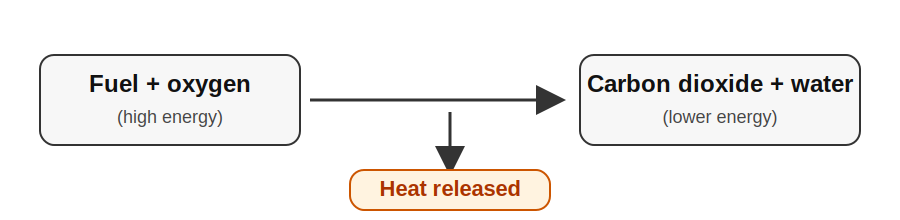
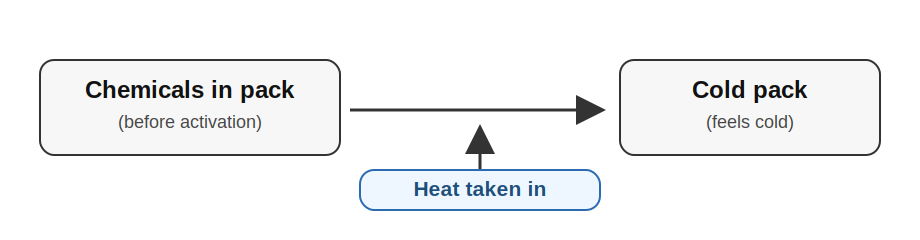
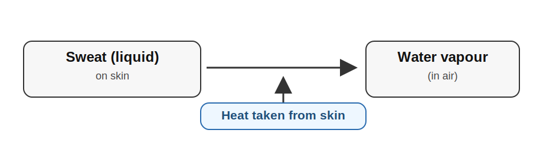
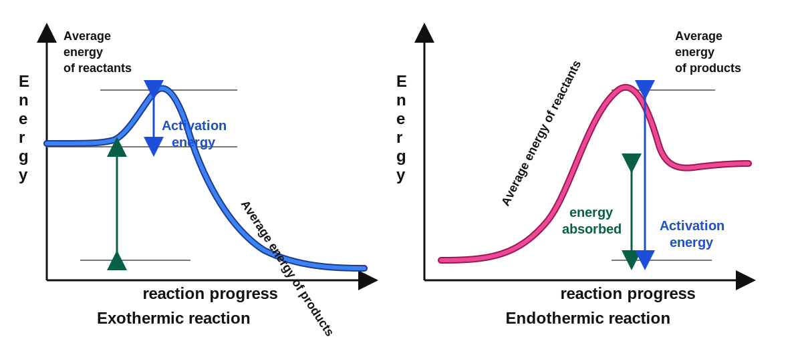

<!-- filename: chemistry5_energy-changes.md -->

# GCSEs for Dads – Chemistry 5: Energy Changes

**Don’t worry about reading the formulas now. Just know they’re here at the top if you need them. Scroll down to start.**

You don’t need to memorise these straight away. Just get familiar with what they look like.

---

## Energy Changes – Key Ideas

| Term | What it means | Key idea |
|------|----------------|----------|
| Exothermic reaction | Releases energy to surroundings | Temperature increases |
| Endothermic reaction | Takes in energy from surroundings | Temperature decreases |
| Activation energy | Energy needed to start a reaction | Must be overcome for reaction to occur |
| Energy profile diagram | Graph showing energy changes during a reaction | Shows reactants, products, and activation energy |

## Symbols and Units

| Symbol | Meaning | Unit |
|--------|---------|------|
| ΔH | Energy change | kJ |
| °C | Temperature | degrees Celsius |
| ↑ | Increase |  |
| ↓ | Decrease |  |

---

# Chemistry 5: Energy Changes

## 1. The Big Idea (30 seconds)

- Chemical reactions involve energy changes  
- Energy can be released or taken in  
- This affects temperature and how reactions behave  
- Energy changes can be shown on diagrams  

---

## 2. Exothermic Reactions

Exothermic reactions release energy to the surroundings.

- Temperature increases  
- Energy is given out  

In this case the Product is Carbon Dioxide & Water. Heat is just heat and not a chemcial product. Just energy released to the environment. 

Key idea:

- Products have less energy than reactants  

In plain terms:
- The reaction “loses” energy to the outside world.

---

## 3. Endothermic Reactions

Endothermic reactions take in energy from the surroundings.

- Temperature decreases  
- Energy is absorbed  

Example: Ice pack

Example: Sweat

In this case the actual sweat is taking heat into the water from your body and then evaporating. 

Key idea:

- Products have more energy than reactants  

---

## 4. Energy Profile Diagrams

These show the energy changes during a reaction.

Exothermic:

- Starts high  
- Ends lower  

Endothermic:

- Starts low  
- Ends higher  

Key idea:

- The gap at the start is activation energy  

---

## 5. Activation Energy

This is the minimum energy needed for a reaction to start.

- Even exothermic reactions need activation energy  

Example:

- Lighting a match  

Key idea:

- Once started, exothermic reactions keep going  

---
### 6. Why reactions release or take in energy

- Energy is needed to break bonds  
- Energy is released when new bonds form  

Key idea:

- Breaking bonds = endothermic  
- Making bonds = exothermic  

Overall:

- If more energy is released than taken in → exothermic  
- If more energy is taken in than released → endothermic  

---

## 7. Reaction Pathways and Catalysts

Catalysts speed up reactions.

- Lower activation energy  
- Not used up in the reaction  

Example:

- Enzymes in the body  

Key idea:

- Catalysts make reactions easier to start  

---

## 8. Check Your Understanding

- What type of reaction releases energy? ( exothermic )  
- What happens to temperature in an endothermic reaction? ( decreases )  
- What is activation energy? ( energy needed to start reaction )  
- What do catalysts do? ( lower activation energy )  
- Do catalysts get used up? ( no )  

---

## 9. Useful Videos

- Cognito – Exothermic and Endothermic Reactions  
https://www.youtube.com/watch?v=YkW0s7u5q2Y  

- Cognito – Energy Profile Diagrams  
https://www.youtube.com/watch?v=8r0kZ4g4w3I  

- Cognito – Activation Energy and Catalysts  
https://www.youtube.com/watch?v=Z6t5q1y0F3Q  