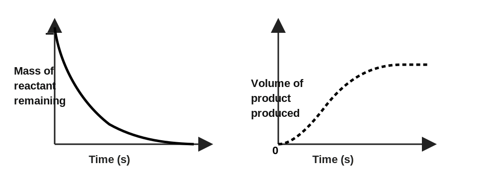
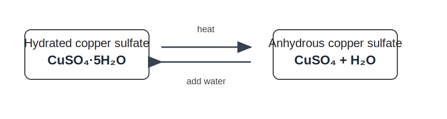

<!-- filename: chemistry6_rate-and-extent-of-chemical-change.md -->

# GCSEs for Dads – Chemistry 6: The Rate and Extent of Chemical Change

**Don’t worry about reading the formulas now. Just know they’re here at the top if you need them. Scroll down to start.**

You don’t need to memorise these straight away. Just get familiar with what they look like.

---

## Rate of Reaction – Key Ideas

| Quantity | Formula | Meaning |
|----------|---------|---------|
| Rate of reaction | rate = Quantity of products formed / time taken (s) | How fast a reaction happens |
| Rate of reaction | Quantity of reactants used / time taken (s) | How fast a reaction happens |
| Collision theory | no fixed formula | Particles must collide correctly |
| Reversible reactions | ⇌ | Reaction can go both ways |
| Equilibrium | no fixed formula | Forward = backward rate |

## Symbols and Units

| Symbol | Meaning | Unit |
|--------|---------|------|
| t | Time | seconds (s) |
| ⇌ | Reversible reaction | no unit |
| ↑ | Increase | no unit |
| ↓ | Decrease | no unit |

---

# Chemistry 6: The Rate and Extent of Chemical Change

## 1. The Big Idea (30 seconds)

- Some reactions are fast, some are slow  
- The speed depends on collisions between particles  
- Conditions can change how fast a reaction happens  
- Some reactions can go both forwards and backwards  

---

## 2. Rate of Reaction

Rate tells you how fast a reaction happens.

- Measured by how quickly a product forms  
- Or how quickly a reactant is used up  

Formula:

- rate = amount ÷ time  

Examples:

- Gas produced per second  
- Mass lost per second  

<!-- insertion for chemistry6_rate_of_reaction_graphs.svg -->

---

## 3. Collision Theory

For a reaction to happen:

- Particles must collide  
- Collisions must have enough energy  
- Collisions must be in the correct orientation  

Key idea:

- Not every collision leads to a reaction  

---

## 4. Factors Affecting Rate

Key idea:

- Reaction rate increases when:
  - Particles have more energy  
  - There are more particles in the same space  

Temperature:

- Higher temperature → particles move faster  
- Collisions are more energetic  
- More successful collisions → faster reaction  

Concentration (solutions):

- More particles in the same space  
- More collisions → faster reaction  

Pressure (gases):

- Particles forced closer together  
- More collisions → faster reaction  

Surface area:

- Smaller pieces → more exposed area  
- More collisions → faster reaction  

Catalysts:

- Lower activation energy  
- More collisions are successful → faster reaction  

---

## 5. Reversible Reactions

Some reactions can go in both directions.

- Forward reaction: reactants → products  
- Backward reaction: products → reactants  

Shown as:

- ⇌  

Example: Copper Sulfate

<!-- insertion for chemistry6_hydrated_copper_sulfate_reversible.svg -->

---

## 6. Dynamic Equilibrium

In a closed system:

- Reactions can reach equilibrium  

This means:

- Forward rate = backward rate  

Key idea:

- Concentrations stay constant  
- Reactions are still happening  

##### The “dynamic” bit (this is what people miss)

It’s not static like “nothing is happening”

It’s more like:

- molecules breaking apart
- molecules reforming

…all the time. Just perfectly balanced.

Everything is still reacting, it’s just cancelling itself out. That’s it.

---

## 7. Check Your Understanding

- What does rate measure? ( how fast a reaction happens )  
- What must happen for a reaction to occur? ( successful collisions )  
- What increases rate? ( temperature, concentration, surface area, catalyst )  
- What is a reversible reaction? ( goes both directions )  
- What happens at equilibrium? ( forward rate = backward rate )  

## 8. Real World Examples

Striking a match:

- Friction provides energy  
- Raises temperature quickly  
- Reaction starts instantly  

Fireworks:

- Very fine powders → huge surface area  
- Reactions happen extremely fast  
- Energy released quickly (light, sound, heat)  

Rusting on a car wheel:

- Reaction between iron, oxygen and water  
- Happens very slowly  
- Low temperature and low energy → slow rate  

Cooking food:

- Heat increases particle energy  
- Reactions happen faster  
- Food changes texture and colour  

Fuel burning in an engine:

- Fuel is mixed with oxygen and compressed  
- High temperature and pressure  
- Very fast reaction releases energy  

---

## 9. Useful Videos

[Rates of Reaction](https://youtu.be/HaQm4pNMZug?si=KV6MsXURS5P6SQgm)  

[Collision Theory](https://youtu.be/JK7yPzO9POU?si=1YmK5O9EvA2LURI6)

[Reverseable Reactions & Dynamic Equilibrium](https://youtu.be/5rC6f_P_A48?si=EvHOPu-9ueCPFeJV)