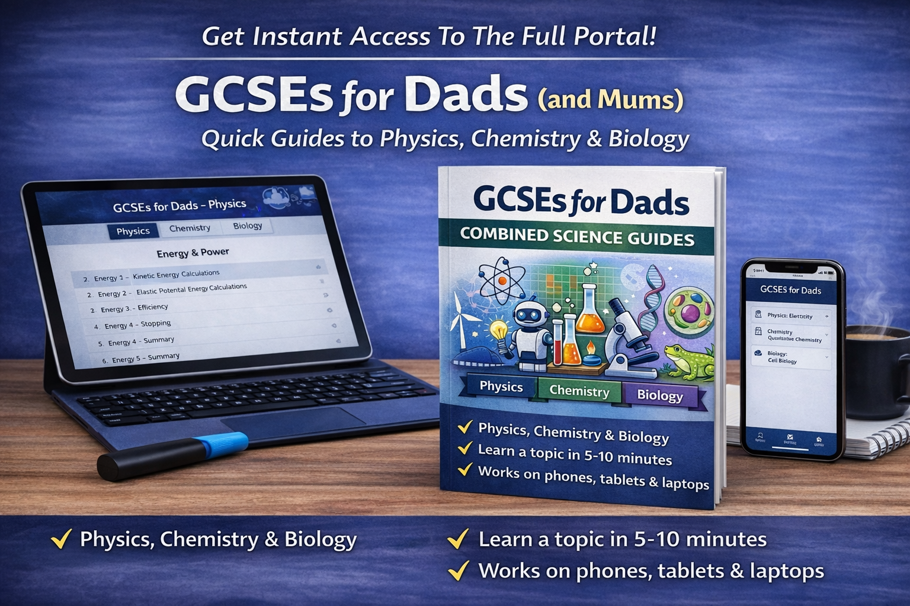
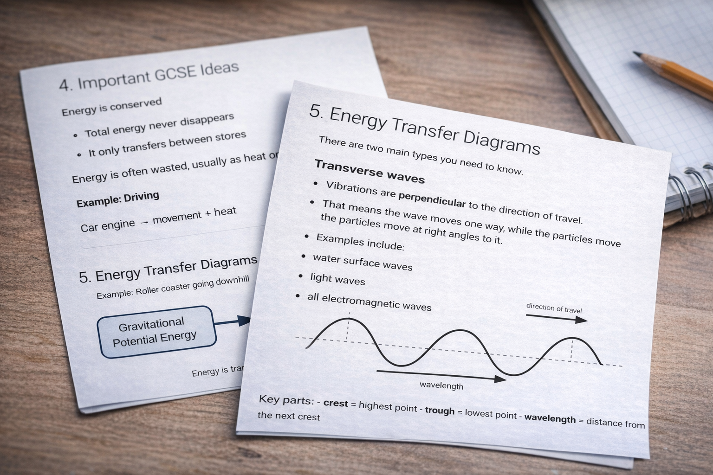

# GCSEs for Dads (and Mums)

Need to help with your child’s homework, but can’t quickly remember the topic?

The information is out there, but it’s scattered, overcomplicated, or takes too long to find when you need it.

**GCSEs for Dads cuts through that.**

These are simple, clear topic guides designed to help you understand what matters in minutes.

- Understand the topic in 5 to 10 minutes  
- Feel confident helping straight away  
- No digging through textbooks or long videos  

Built to work from any device, so you can get up to speed wherever you are.

---

## Get started

[Access all available courses here](https://payhip.com/gcsesfordads)

---

## How these guides work

Each chapter is designed to be quick to scan and easy to come back to:

- Understand the topic in 5–10 minutes  
- Clear explanations  
- Simple diagrams  
- Quick check-your-understanding questions  
- Curated links to help reinforce understanding  

---

## Subjects Available

### Physics

The course includes:

- Electricity  
- Waves  
- Atomic Structure and Radiation  
- Energy  
- Magnetism and Electromagnetism  
- Forces  
- Space Physics  
- Particle Model of Matter  

[Get full access here](https://payhip.com/gcsesfordads) 

---

### Chemistry

The course includes:

- Atomic Structure and the Periodic Table  
- Bonding, Structure and Properties  
- Quantitative Chemistry  
- Chemical Changes  
- Energy Changes  
- Rate and Extent of Chemical Change  
- Organic Chemistry  
- Chemical Analysis  
- Chemistry of the Atmosphere  
- Using Resources  

Full Chemistry course coming shortly  

---

### Biology

The course includes:

- Cell Biology  
- Organisation  
- Infection and Response  
- Bioenergetics  
- Homeostasis and Response  
- Inheritance, Variation and Evolution  
- Ecology  

Full Biology course coming shortly  

---

## Try a free sample

Start here and see how it works:

[Sample Lessons](demo/index.md)

---

Used by parents who want to help without wasting time.

## Why did I build this?

I kept finding that when you try to help your child with homework, the hardest part is not that the information does not exist.

**It is that it takes too long to find.**

And when you do find it, it is often buried in revision sites, long videos, or textbooks that are not built for a busy parent trying to get up to speed quickly.

I wanted something simpler. Something you could **read on your phone in 5 to 10 minutes** and come away actually understanding the topic well enough to help.

I found it frustrating that my son would guess his way through questions, and then we would have to spend time watching videos. A short piece of homework might take three times as long, or be left incomplete, and I was left scrabbling around trying to find the information quickly.

Trying to get ahead, I would be sat in a dark car with textbooks and a phone trying to understand Biology or Chemistry while he played football. It never really worked.

Even finding short educational videos can be hit and miss, often involving time spent searching, only to land on a set of slides with a teacher reading them out.

That is what these guides are for.

They are not designed to replace school, teachers, or proper revision. 

**They are designed to help parents cut through the noise, refresh their memory fast, and feel confident when homework questions come up.**