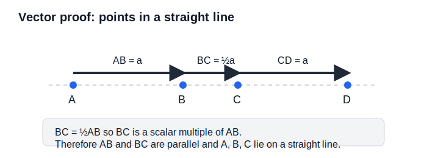

# GCSEs for Dads – Maths 10: Vectors

**Don’t worry about reading the formulas now. Just know they’re here at the top if you need them. Scroll down to start.**

You don’t need to memorise these formulas. Just know where to find them.

---

## Vectors Formulas

| Quantity | Formula | Meaning |
|----------|---------|---------|
| Vector notation | **a**, **b** | vectors are written in bold |
| Column vector | ( x ) ( y ) | movement in x and y direction |
| Vector addition | **a** + **b** | combine movements |
| Vector subtraction | **a** − **b** | difference between movements |
| Scalar multiplication | k**a** | stretch or shrink a vector |
| Parallel vectors | **a** = k**b** | vectors are multiples of each other |

## Symbols and Units

| Symbol | Meaning | Unit |
|--------|---------|------|
| **a**, **b** | vectors | no unit |
| k | scalar (number multiplier) | no unit |
| (x, y) | coordinates | units depend on context |

---

# Maths 10: Vectors

## 1. The Big Idea (30 seconds)

Vectors describe **movement**.

They tell you
- how far
- and in what direction

They do **not** care about position, only the journey.

Think of them like instructions
- “go 3 right and 2 up”

---

## 2. What is a Vector?

A vector can be written as a column:

( 3 )  
( 2 )

This means:
- 3 to the right  
- 2 up  

You can also draw it as an arrow.

---

## 3. Adding Vectors

You add vectors by combining movements.

( 3 )   +   ( 1 )   =   ( 4 )  
( 2 )   +   ( 5 )   =   ( 7 )

- Right: 3 + 1 = 4  
- Up: 2 + 5 = 7  

So the total movement is:
( 4 )  
( 7 )

---

## 4. Subtracting Vectors

Subtracting is just finding the difference.

( 5 )   −   ( 2 )   =   ( 3 )  
( 7 )   −   ( 4 )   =   ( 3 )

So the movement from one point to another is:
( 3 )  
( 3 )

---

## 5. Multiplying by a Scalar

A scalar is just a number.

2 × ( 3 )   =   ( 6 )  
   ( 4 )       ( 8 )

- Everything gets doubled.
- This stretches the vector.

---

## 6. Describing Points with Vectors

You often see points described using vectors from an origin.

If:
OA = ( 2 )  
    ( 3 )

That means point A is 2 right and 3 up from O

---

## 7. Vector Proof (Exam Favourite)

This is where people panic, but it is just algebra with vectors.

You might be asked to show points are in a straight line or parallel.

Example idea:
- If AB = kBC  
- Then they are parallel

Key rule:
Vectors are parallel if one is a multiple of the other.

---

## 8. Key Things to Watch

- Direction matters  
- Order matters in subtraction  
- Always keep vectors in column form  
- Look for common factors in proof questions  

---

## 9. Check Your Understanding

- What does the vector ( 4 ) ( 1 ) represent?  (4 right, 1 up)
- Addition: ( 2 ) ( 3 ) + ( 1 ) ( 4 ) ? (3, 7)
- Subtraction: ( 6 ) ( 5 ) − ( 2 ) ( 1 ) ? (4, 4)
- Multiplication: 3 × ( 2 ) ( 1 ) => (6, 3)
- If **a** = ( 2 ) ( 4 ) and **b** = ( 1 ) ( 2 ), are they parallel?  (Yes, **a** = 2**b**)

---

## 10. Suggested Videos

[Vectors](https://youtu.be/PxDfkq3FMaw?si=mCL4iZ6oIabqaEu9)

---