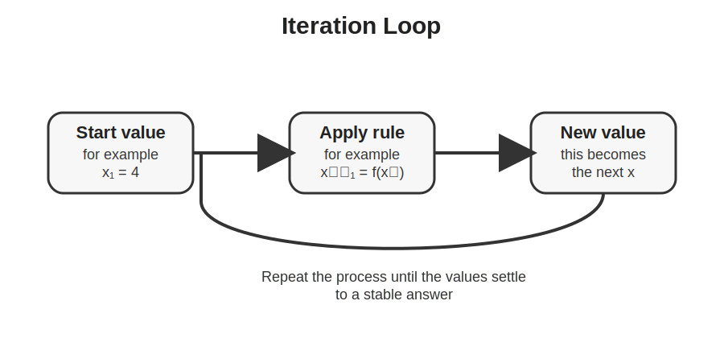

# GCSEs for Dads – Maths 16: Sequences and Iteration

**Don’t worry about reading the formulas now. Just know they’re here at the top if you need them. Scroll down to start.**

You don’t need to memorise these formulas. Just know where to find them.

---

## Sequences and Iteration Formulas

| Quantity | Formula | Meaning |
|----------|---------|---------|
| nth term of an arithmetic sequence | term = common difference × n + constant | rule for finding any term in a linear sequence |
| common difference | difference between consecutive terms | the amount added or subtracted each time |
| iteration formula | xₙ₊₁ = f(xₙ) | next value is found by putting the current value into a rule |
| quadratic sequence form | an² + bn + c | general form for many quadratic nth term rules |

## Symbols and Units

| Symbol | Meaning | Unit |
|--------|---------|------|
| n | term number | no unit |
| xₙ | current value in an iteration | no unit |
| xₙ₊₁ | next value in an iteration | no unit |
| a, b, c | constants in a rule | no unit |

---

# Maths 16: Sequences and Iteration

## 1. The Big Idea (30 seconds)

- A sequence is a list of numbers that follows a pattern.
- You may need to continue the pattern, find a missing term, or write a rule for the nth term.
- Iteration means repeatedly using the same rule again and again.
- In GCSE maths, iteration is usually done on a calculator to get closer to an answer.

## 2. What is a sequence?

A sequence is just numbers written in order according to a rule.

Example:

2, 5, 8, 11, 14, ...

Here the pattern is simple:

- Start at 2
- Add 3 each time

This is called an arithmetic sequence because the difference between terms stays the same.

## 3. Finding the nth term of a linear sequence

The nth term is a rule that lets you jump straight to any term in the sequence.

Example:

2, 5, 8, 11, 14, ...

Step 1: Find the common difference

- The sequence goes up by 3 each time

So the rule will start with:

3n

Step 2: Check what happens when n = 1

- 3 × 1 = 3
- But the first term is 2

So 3n is 1 too big.

Final rule:

2, 5, 8, 11, 14, ... = **3n - 1**

Check it:

- n = 1 gives 3(1) - 1 = 2
- n = 2 gives 3(2) - 1 = 5

That works.

## 4. Another linear example

Sequence:

4, 7, 10, 13, ...

- Common difference is 3
- Start with 3n
- When n = 1, 3n gives 3
- But the first term is 4

So add 1.

Nth term:

**3n + 1**

## 5. Common sequence questions

You might be asked to:

- Write the next few terms
- Find the nth term
- Decide if a number is in the sequence
- Find a specific term such as the 20th term

Example:

Sequence: 6, 10, 14, 18, ...

Nth term:

- Difference is 4, so start with 4n
- First term is 6, but 4n gives 4 when n = 1
- Add 2

Rule:

**4n + 2**

Now the 20th term is:

4(20) + 2 = 82

## 6. Quadratic sequences

Some sequences do not increase by the same amount.

Example:

1, 4, 9, 16, 25, ...

Differences are:

- +3, +5, +7, +9

The differences are not equal, but the second differences are.

This is a quadratic sequence.

In this case the rule is:

**n²**

Another example:

3, 8, 15, 24, ...

You do not always need to fully build the quadratic rule unless your course asks for it, but you should recognise that:

- equal first differences means linear
- equal second differences usually means quadratic

## 7. What is iteration?

Iteration means:

- start with a value
- put it into a formula
- get a new value
- put that new value back into the formula
- keep repeating

So iteration is basically a loop.

Here is the idea visually:

## 8. Iteration example

Suppose:

**xₙ₊₁ = 0.5(xₙ + 10)**

and the starting value is:

**x₁ = 4**

Now work through it:

- x₂ = 0.5(4 + 10) = 7
- x₃ = 0.5(7 + 10) = 8.5
- x₄ = 0.5(8.5 + 10) = 9.25
- x₅ = 0.5(9.25 + 10) = 9.625

The numbers get closer and closer to 10.

That is the whole point of iteration. You keep applying the rule until the answer settles down.

## 9. What the exam is testing in iteration

Usually the exam wants to know if you can:

- use the calculator correctly
- keep using the same rule
- avoid rounding too early
- give the final answer to the required number of decimal places

A lot of these questions are more about being careful than being clever.

## 10. How to do iteration on a calculator

Typical method:

- type the starting value into the formula
- press equals
- use the answer button or the previous result
- repeat
- stop when the value stops changing much

Do not round every step unless the question tells you to.

Round at the end.

## 11. Common mistakes

- Using the wrong starting value
- Mixing up xₙ and xₙ₊₁
- Rounding too early
- Losing track of which term you are on
- Writing down a value before the calculator has settled

## 12. Exam tip

If you see something like this:

**xₙ₊₁ = √(7 + xₙ)** with **x₁ = 2**

do not panic.

Just think:

- current value goes in
- next value comes out
- repeat

That is all iteration is.

## Check your understanding

Write the next two terms of the sequence  
2, 5, 8, 11, ...  
(14, 17)

Find the nth term of  
3, 7, 11, 15, ...  
(4n - 1)

Find the 10th term of  
5, 8, 11, 14, ...  
(32)

State whether this sequence is linear or quadratic  
1, 4, 9, 16, 25, ...  
(quadratic)

Use iteration for one step only:  
xₙ₊₁ = 0.5(xₙ + 6), x₁ = 2  
Find x₂  
(4)

Use iteration for two steps:  
xₙ₊₁ = xₙ + 3, x₁ = 5  
Find x₃  
(11)

## Suggested Videos

[Types of Sequences](https://youtu.be/D2bZcm2NnfU?si=2oOukYbKBJGUHKu7)

[Quadratic Nth term](https://youtu.be/7Isa4P8lISc?si=wY8twao-XOf90Kka)

[Finding Nth term for linear](https://youtu.be/RAjTpz3yQ3Q?si=rHeBoeWrMiBdJbwX)

---