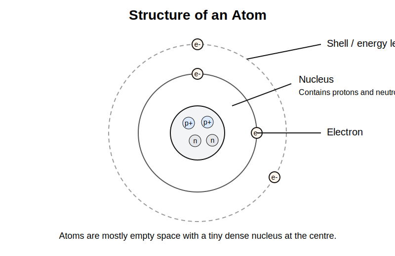
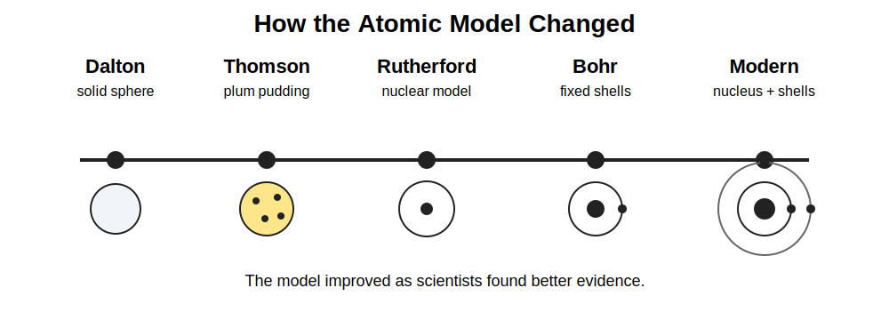
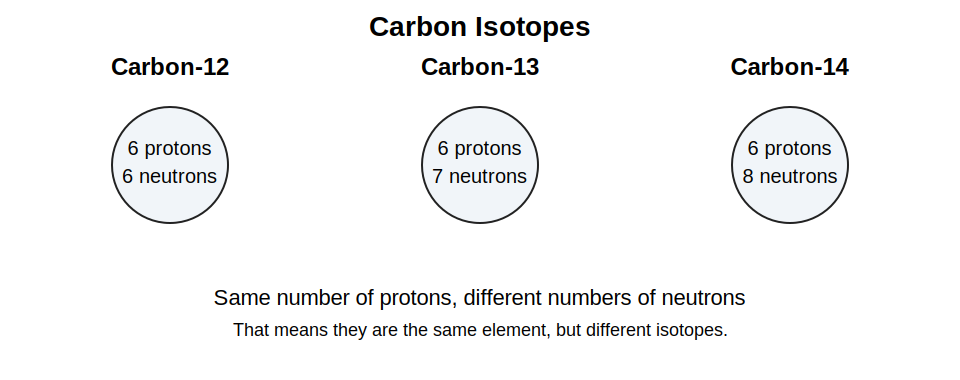
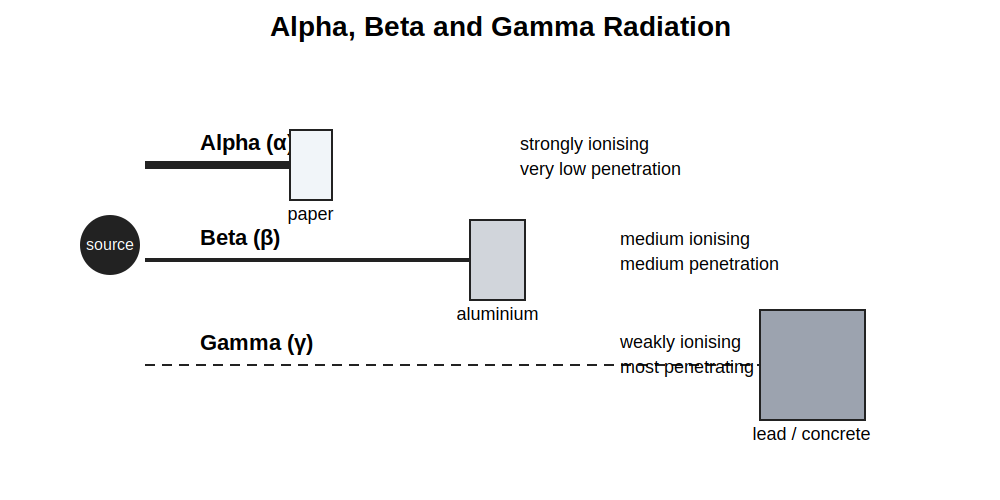
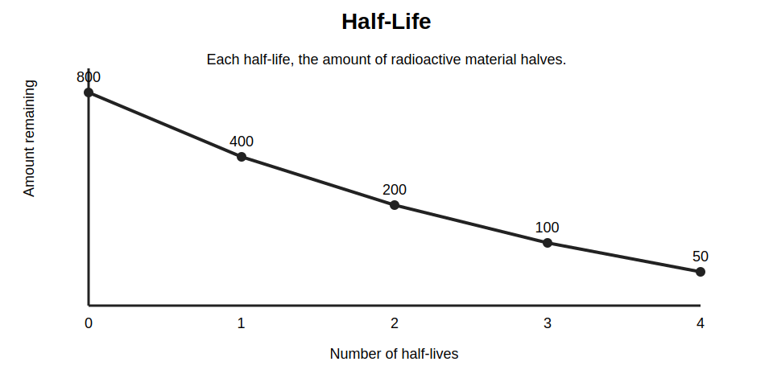
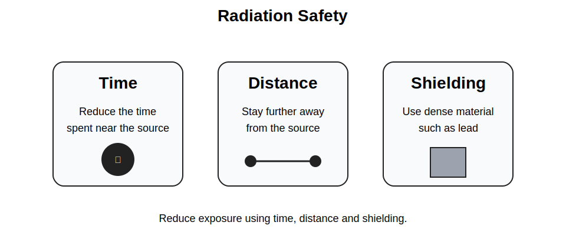

# GCSEs for Dads – Physics 4: Atomic Structure and Radiation

**Don’t worry about reading the formulas now. Just know they’re here at the top if you need them. Scroll down to start.**

You don’t need to memorise these formulas. Just know where to find them.

---

## Atomic Structure and Radiation Formulas

| Quantity | Formula | Meaning |
|----------|---------|---------|
| Half-life | no fixed equation | time taken for half the unstable nuclei to decay |
| Activity | counts per second | how many decays happen each second |
| Absorbed dose | measured in grays | energy absorbed by tissue from radiation |

## Symbols and Units

| Symbol | Meaning | Unit |
|--------|---------|------|
| α | Alpha radiation | no unit |
| β | Beta radiation | no unit |
| γ | Gamma radiation | no unit |
| A | Activity | Becquerel (Bq) |
| D | Absorbed dose | Gray (Gy) |
| t½ | Half-life | time |

---

# Physics 4: Atomic Structure and Radiation

## 1. The Big Idea (30 seconds)

- Everything is made of atoms.
- Atoms are incredibly small but contain even smaller particles.
- Some nuclei are unstable and give out radiation.
- This matters in medicine, industry, archaeology and energy.

---

## 2. Structure of the Atom

Atoms contain three main particles.

| Particle | Charge | Relative Mass | Location |
|----------|--------|---------------|----------|
| Proton | +1 | 1 | Nucleus |
| Neutron | 0 | 1 | Nucleus |
| Electron | -1 | Very small | Electron shells |

### Important ideas

- The nucleus is tiny but contains most of the mass.
- Electrons move around the nucleus in energy levels, also called shells.
- Atoms are mostly empty space.

### Example: Carbon atom

- 6 protons
- 6 neutrons
- 6 electrons

---

## 3. How Our Model of the Atom Changed

Scientists improved the atomic model over time.

### Dalton
- Atoms were thought to be solid spheres.

### Thomson
- Discovered electrons.
- Proposed the plum pudding model.
- A ball of positive charge with electrons embedded in it.

### Rutherford
- Used the gold foil experiment.
- Showed that atoms are mostly empty space.
- Found that a tiny, dense nucleus exists at the centre.

### Bohr
- Proposed that electrons move in fixed energy levels around the nucleus.

### Modern model
- Protons and neutrons are in the nucleus.
- Electrons are in energy levels around the nucleus.

---

## 4. Isotopes

Atoms of the same element can have different numbers of neutrons.

These are called isotopes.

### Example: Carbon isotopes

| Isotope | Protons | Neutrons |
|---------|---------|----------|
| Carbon-12 | 6 | 6 |
| Carbon-13 | 6 | 7 |
| Carbon-14 | 6 | 8 |

### Key rule

- Same number of protons = same element
- Different number of neutrons = different isotope

---

## 5. Radioactivity

Some atomic nuclei are unstable.

They break down and release radiation. This process is called radioactive decay.

### Important facts

- Radioactive decay is random.
- You cannot predict exactly when one nucleus will decay.
- You can measure the rate of decay for a large sample.

---

## 6. Types of Nuclear Radiation

There are three main types.

### Alpha radiation (α)

Alpha particles contain:
- 2 protons
- 2 neutrons

This is the same as a helium nucleus.

Properties:
- heavy particle
- strongly ionising
- very short range

Stopped by:
- paper
- skin

Danger:
- not very dangerous outside the body
- dangerous if inhaled or swallowed

### Beta radiation (β)

Beta radiation is a fast electron.

Properties:
- medium penetration
- medium ionising power

Stopped by:
- thin aluminium

### Gamma radiation (γ)

Gamma rays are electromagnetic waves.

Properties:
- no mass
- no charge
- very penetrating
- weakly ionising

Stopped by:
- thick lead
- thick concrete

---

## 7. Half-Life

Radioactive materials decay over time.

Half-life is the time taken for half of the unstable nuclei in a sample to decay.

### Example starting with 800 atoms

- After one half-life, 400 atoms remain
- After two half-lives, 200 atoms remain
- After three half-lives, 100 atoms remain

The amount halves each time.

---

## 8. Uses of Radiation

Radiation has several useful applications.

### Medicine

- cancer treatment using radiotherapy
- medical tracers
- sterilising equipment

### Industry

- thickness gauges for paper and metal
- leak detection in pipes

### Archaeology

- carbon dating to estimate the age of ancient objects

---

## 9. Nuclear Safety

Radiation can damage cells and tissue.

Scientists reduce exposure using three main methods:

- **Time**: reduce the time spent near the source
- **Distance**: stay further from the source
- **Shielding**: use dense materials such as lead

---

## 10. Check Your Understanding

- What particles are found in the nucleus? (protons and neutrons)
- What charge does an electron have? (negative)
- What is an isotope? (atoms of the same element with different numbers of neutrons)
- Which type of radiation is the most penetrating? (gamma)
- Which type of radiation is stopped by paper? (alpha)
- What is half-life? (the time taken for half the unstable nuclei to decay)
- Why is alpha radiation especially dangerous inside the body? (because it is strongly ionising)
- What are the three main ways of reducing radiation exposure? (time, distance and shielding)

---

## 11. Common Exam Traps

- **Mass number and atomic number are not the same**  
  Atomic number = number of protons.  
  Mass number = protons + neutrons.

- **Isotopes are not different elements**  
  They are the same element because they have the same number of protons.

- **Radiation is random**  
  You cannot predict when one nucleus will decay.

- **Gamma is not a particle**  
  It is an electromagnetic wave.

- **Alpha is weak at penetrating but strong at ionising**  
  Those are different ideas.

---

## 12. Quick Memory Hooks

- **atom** = tiny structure making up matter
- **nucleus** = dense centre
- **isotope** = same protons, different neutrons
- **alpha** = heavy and strongly ionising
- **beta** = medium penetration
- **gamma** = most penetrating
- **half-life** = halves each time
- **radiation safety** = time, distance, shielding

---

## 13. Now Watch These

- [Atomic Structure](https://youtu.be/GTpo1nAZqFE?si=0VKePttGg8nDisVC)
- [Alpha, Beta and Gamma Radiation](https://youtu.be/1ui5YnYkYpc?si=XbOrDG0ncuQp858H)
- [Radioactive Decay & Half-Life](https://youtu.be/wvgT52mwM3Y?si=RPlnWwyCrZgyZQ_7)

---

## 14. Real-Life Questions

### Question 1

Why can alpha radiation be stopped by a sheet of paper?

**Answer:**

Alpha particles are relatively large and heavy. They collide easily with atoms in the paper, so they lose energy quickly and cannot travel far.

### Question 2

Smoke detectors use a small radioactive source. Explain how this helps detect smoke.

**Answer:**

The radioactive source emits alpha radiation, which ionises the air and allows a small electric current to flow. When smoke enters the detector, it absorbs the alpha particles, so the current drops and the alarm is triggered.