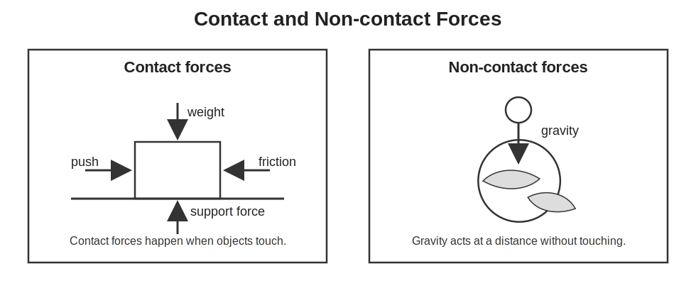
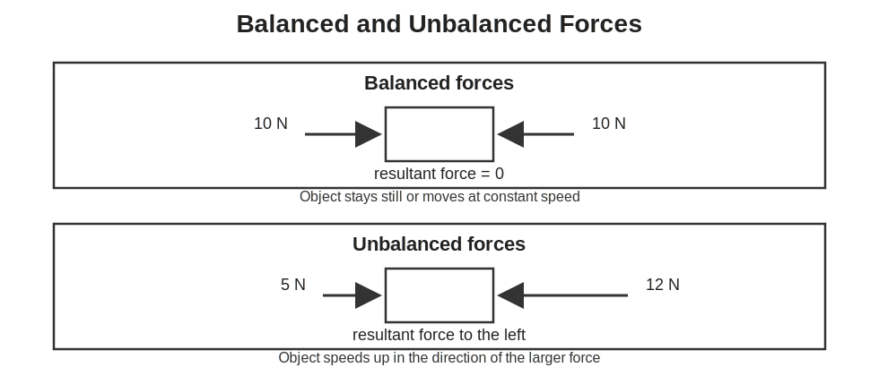
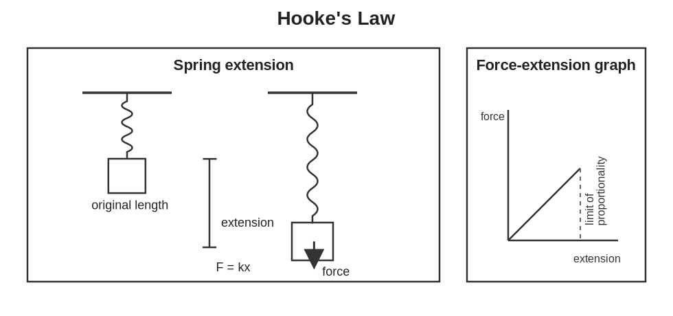
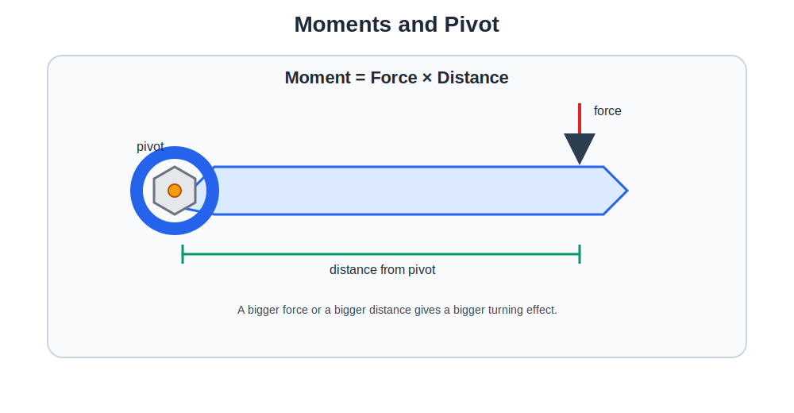
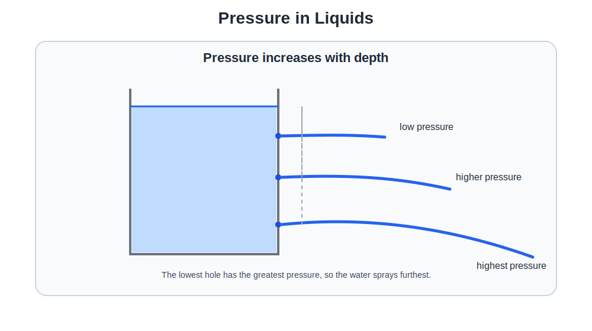
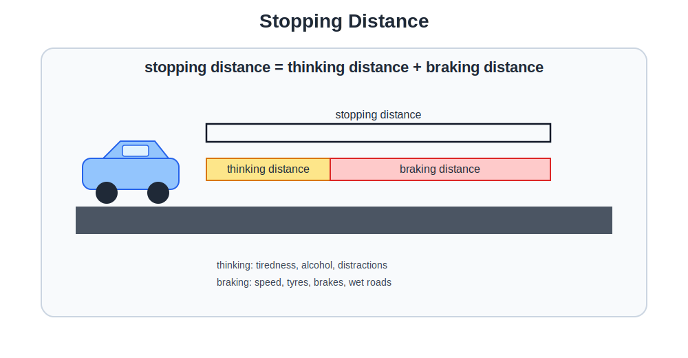

# GCSEs for Dads – Physics 5: Forces

**Don’t worry about reading the formulas now. Just know they’re here at the top if you need them. Scroll down to start.**

You don’t need to memorise these formulas. Just know where to find them.

---

## Forces Formulas

| Quantity | Formula | Meaning |
|----------|---------|---------|
| Weight | W = mg | weight = mass × gravity |
| Work Done | W = F × d | force × distance moved |
| Hooke’s Law | F = kx | force = spring constant × extension |
| Pressure | P = F ÷ A | force ÷ area |
| Moment | moment = F × d | turning force = force × distance from pivot |
| Stopping Distance | stopping distance = thinking distance + braking distance | total distance before a vehicle stops |

## Symbols and Units

| Symbol | Meaning | Unit |
|--------|---------|------|
| W | Weight / Work done | Newtons (N) / Joules (J) |
| m | Mass | kilograms (kg) |
| g | Gravitational field strength | N/kg |
| F | Force | Newtons (N) |
| d | Distance | metres (m) |
| k | Spring constant | N/m |
| x | Extension | metres (m) |
| P | Pressure | Pascals (Pa) |
| A | Area | m² |

---

# Physics 5: Forces

## 1. The Big Idea (30 seconds)

- A force is a push or a pull.
- Forces can make things speed up, slow down, change direction, or change shape.
- If forces are balanced, nothing changes.
- If forces are unbalanced, something accelerates.
- A lot of GCSE Physics is really about spotting which forces are acting and what the overall effect is.

---

## 2. What Is a Force?

A force is a push or a pull that can change how an object moves.

Forces can:

- start an object moving
- stop an object moving
- change the speed of an object
- change the direction of motion
- change the shape of an object

Forces are measured in **Newtons (N)** using a **Newton meter**.

---

## 3. Contact and Non-Contact Forces

### Contact forces
These happen when objects are touching.

Examples:

- **friction**: resists movement between surfaces
- **air resistance (drag)**: friction between an object and air
- **water resistance**: drag in water
- **tension**: pulling force through a rope or cable
- **normal contact force**: support force from a surface

**Example:**  
When you push a box across the floor:

- your push acts forward
- friction acts backward

### Non-contact forces
These act without objects touching.

Examples:

- **gravity**
- **magnetic force**
- **electrostatic force**

**Example:**  
The Earth pulls objects downward using gravity even though nothing is physically touching them.

---

## 4. Weight and Gravity

Gravity is the force that attracts objects with mass toward each other.

On Earth, gravity pulls objects toward the centre of the planet.

**Weight** is the force caused by gravity acting on a mass.

### Equation
**W = mg**

Where:

- **W** = weight in Newtons (N)
- **m** = mass in kilograms (kg)
- **g** = gravitational field strength in N/kg

On Earth, **g ≈ 9.8 N/kg**  
In many GCSE questions, this is rounded to **10 N/kg**.

### Example
A 10 kg object has a weight of:

**W = 10 × 9.8 = 98 N**

Mass stays the same wherever you go.  
Weight changes because gravity changes.

---

## 5. Resultant Forces

Objects often have more than one force acting on them.

The **resultant force** is the overall force after all the forces are combined.

### Balanced forces
Balanced forces mean:

- the forces are equal
- they act in opposite directions
- the resultant force is zero

**Result:**

- the object stays still, or
- it keeps moving at a constant speed in a straight line

**Example:**  
A book resting on a table:

- weight acts downward
- support force acts upward

These forces are balanced.

### Unbalanced forces
Unbalanced forces mean the resultant force is **not zero**.

**Result:**

- the object accelerates
- speed increases or decreases
- direction changes

**Example:**  
If you push a shopping trolley harder than friction pushes back, it accelerates forward.

---

## 6. Work Done

Work is done when a force moves an object through a distance.

### Equation
**W = F × d**

Where:

- **W** = work done in Joules (J)
- **F** = force in Newtons (N)
- **d** = distance moved in the direction of the force in metres (m)

### Example
If a force of 20 N pushes a box 5 m:

**W = 20 × 5 = 100 J**

Work done is **energy transferred**.

That is a really useful GCSE idea:
if work is done, energy has been transferred.

---

## 7. Springs and Hooke’s Law

When a force stretches or compresses a spring, it changes length.

The amount it stretches is called the **extension**.

### Equation
**F = kx**

Where:

- **F** = force in Newtons (N)
- **k** = spring constant in N/m
- **x** = extension in metres (m)

The spring constant tells you how stiff the spring is.

- large **k** = stiff spring
- small **k** = easier to stretch

This rule only works up to the **limit of proportionality**.

Beyond that point:

- force and extension are no longer proportional
- the spring may not return to its original shape

---

## 8. Moments and Levers

A **moment** is the turning effect of a force around a pivot.

Examples include:

- opening a door
- using a spanner
- a seesaw

### Equation
**moment = force × distance**

Where:

- force is measured in **Newtons (N)**
- distance is the **perpendicular distance from the pivot** in **metres (m)**

The unit of moment is **Newton metres (Nm)**.

### Key idea
A force has a bigger turning effect when:

- the force is larger, or
- it acts further from the pivot

That is why door handles are placed far from the hinges.

### Principle of moments
For an object in balance:

**clockwise moments = anticlockwise moments**

---

## 9. Pressure in Fluids

Pressure happens when a force acts over an area.

### Equation
**P = F ÷ A**

Where:

- **P** = pressure in Pascals (Pa)
- **F** = force in Newtons (N)
- **A** = area in m²

### Key idea
For the same force:

- **smaller area = greater pressure**
- **larger area = lower pressure**

That is why:
- sharp knives cut better
- snowshoes stop you sinking as much

### Pressure in liquids
In liquids, pressure increases with:

- **depth**
- **density of the liquid**

**Example:**  
A diver feels greater pressure the deeper they go.

---

## 10. Stopping Distance

Stopping distance is the total distance a vehicle travels before it stops.

### Equation
**stopping distance = thinking distance + braking distance**

### Thinking distance
This is the distance travelled while the driver reacts.

Typical reaction time is about **0.7 seconds**.

Things that increase thinking distance:

- tiredness
- alcohol or drugs
- distractions such as phones

### Braking distance
This is the distance travelled after the brakes are applied.

Things that increase braking distance:

- higher speed
- worn tyres
- worn brakes
- wet or icy roads
- heavier vehicles

### Important GCSE point
Speed affects stopping distance a lot.

The faster a car is going, the much longer it takes to stop.

---

## 11. Check Your Understanding

- What is the difference between contact and non-contact forces?  
  **Contact forces need objects to touch. Non-contact forces act at a distance.**

- What does it mean if forces are balanced?  
  **They are equal and opposite, so the resultant force is zero.**

- What does the spring constant represent?  
  **It shows how stiff a spring is.**

- What is a moment?  
  **The turning effect of a force around a pivot.**

- What happens to pressure in a liquid as depth increases?  
  **It increases.**

- What two distances make up stopping distance?  
  **Thinking distance and braking distance.**

---

## 12. Common Exam Traps

- **Mass and weight are not the same thing**  
  Mass is measured in kg. Weight is a force measured in N.

- **Balanced forces do not mean no forces**  
  It just means the overall force is zero.

- **Work done only counts if the object moves**  
  No movement means no work done.

- **Hooke’s Law does not always apply**  
  It only works before the limit of proportionality.

- **Pressure depends on area**  
  Same force over a smaller area means bigger pressure.

- **Moment distance must be perpendicular**  
  It is not just any distance from the pivot.

---

## 13. Quick Memory Hooks

- **Force** = push or pull  
- **Resultant force** = overall force  
- **Weight** = mass × gravity  
- **Work done** = force × distance  
- **Hooke’s Law** = force linked to extension  
- **Moment** = turning effect  
- **Pressure** = force ÷ area  
- **Stopping distance** = thinking + braking

---

## 14. Now Watch These

- [Contact and Non-Contact Forces](https://youtu.be/xdrE0kP8GTM?si=tem8f5F5-obb-BEf)
- [Hooke’s Law and Springs](https://youtu.be/abWi5y6bJ9k?si=kVNh03EiTUIkjhc2)
- [Stopping Distance](https://youtu.be/q0yjYZdTS3I?si=GVVL1AkejeCky8do)
