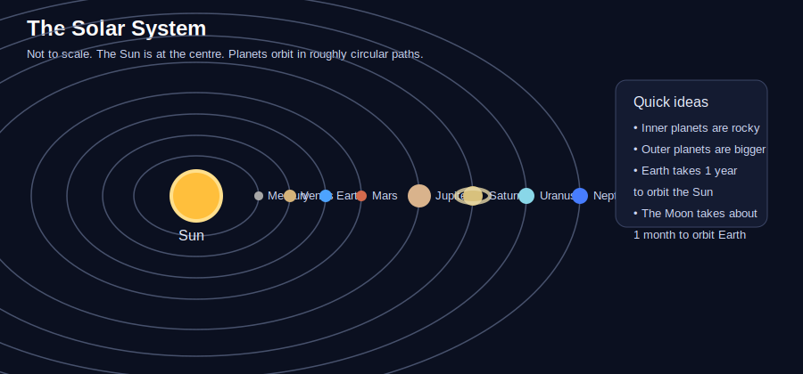
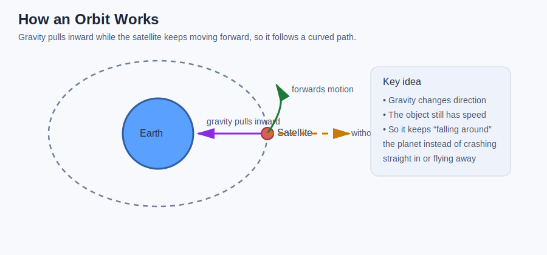
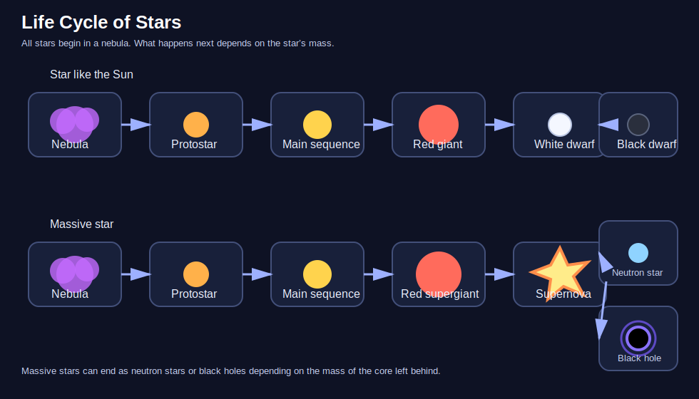
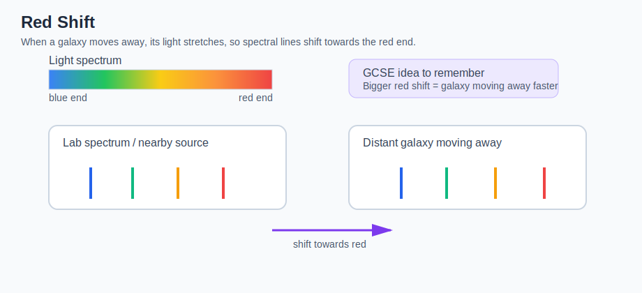

# GCSEs for Dads – Physics 8: Space Physics

**Don’t worry about reading the formulas now. Just know they’re here at the top if you need them. Scroll down to start.**

You don’t need to memorise these formulas. Just know where to find them.

---

## Space Physics Formulas

| Quantity | Formula | Meaning |
|----------|---------|---------|
| Orbital speed | v = 2πr ÷ T | orbital speed = circumference of orbit ÷ time for one orbit |
| Distance | distance = speed × time | distance travelled = speed multiplied by time |
| Red shift relationship | Greater red shift = faster recession | the more a galaxy’s light is red-shifted, the faster it is moving away |

## Symbols and Units

| Symbol | Meaning | Unit |
|--------|---------|------|
| v | Speed | metres per second (m/s) |
| r | Radius of orbit | metres (m) |
| T | Time period | seconds (s) |
| π | Pi | no unit |

---

# Physics 8: Space Physics

## 1. The Big Idea (30 seconds)

- Space physics explains where Earth fits in the solar system, galaxy and universe.
- It helps explain why planets orbit, how satellites work, and why we get seasons.
- It also explains how stars form, change over time, and eventually die.
- At the biggest scale, it helps scientists understand how the universe began and how it is changing.

---

## 2. The Solar System

The solar system consists of the Sun, planets, dwarf planets, moons, asteroids and comets.

- The **Sun** is at the centre of the solar system.
- The **eight planets** orbit the Sun in roughly circular paths.
- The planets, in order from the Sun, are:

  - Mercury
  - Venus
  - Earth
  - Mars
  - Jupiter
  - Saturn
  - Uranus
  - Neptune

- The **inner planets** are rocky.
- The **outer planets** are much larger and are mostly made of gas or ice.

### Quick facts

- Earth orbits the Sun once every **year**.
- The Moon orbits Earth about once every **month**.

---

## 3. Orbital Motion

An orbit happens when one object moves around another because of **gravity**.

Gravity provides the force that keeps planets, moons and satellites in orbit.

Without gravity, an object would move off in a straight line.

In a circular orbit:

- gravity pulls the object towards the centre
- the object is already moving forwards
- this combination makes it travel in a curved path

### Key ideas

- Bigger gravitational force can keep objects in tighter or faster orbits.
- Objects closer to a planet or star usually orbit faster.
- The further away a planet is from the Sun, the longer its year tends to be.

### Examples

- The Moon stays in orbit around Earth because Earth’s gravity pulls it inward.
- An artificial satellite stays in orbit for the same reason.

---

## 4. Satellites

A satellite is any object that orbits a planet or star.

There are two types:

- **Natural satellites** - these occur naturally
- **Artificial satellites** - these are made by humans and placed into orbit

### Examples

- The **Moon** is a natural satellite of Earth.
- A **GPS satellite** is an artificial satellite.

### Artificial satellites are used for:

- communication
- weather forecasting
- GPS and navigation
- TV signals
- observing Earth
- space research

Different satellites orbit at different heights depending on their job.

- **Low orbit satellites** are often used for imaging and observation.
- **Higher orbit satellites** are often used for communication.

### Real-life examples

- Weather satellites can take images of cloud movement.
- GPS satellites help phones and cars work out location.

---

## 5. The Life Cycle of a Star

Stars form from clouds of dust and gas called **nebulae**.

### How a star begins

1. Gravity pulls gas and dust together.
2. As the cloud contracts, it gets hotter.
3. Eventually the centre becomes hot enough for **nuclear fusion** to begin.
4. A star is born.

Most of a star’s life is spent in the **main sequence** stage.

During this stage:

- hydrogen nuclei fuse to form helium
- huge amounts of energy are released

What happens next depends on the size of the star.

### 5.1 Life cycle of a star like the Sun

- Nebula
- Protostar
- Main sequence star
- Red giant
- White dwarf
- Black dwarf

A star like the Sun eventually runs out of hydrogen fuel.

- It expands into a **red giant**.
- Its outer layers drift away.
- The hot core left behind becomes a **white dwarf**.
- Over a very long time it cools and becomes a **black dwarf**.

### 5.2 Life cycle of a massive star

- Nebula
- Protostar
- Main sequence star
- Red supergiant
- Supernova
- Neutron star or black hole

A much more massive star becomes a **red supergiant**.

- It may then explode in a **supernova**.
- This explosion spreads heavy elements into space.
- The remains can become a **neutron star** or, if the core is massive enough, a **black hole**.

---

## 6. Red Shift

Light from distant galaxies can be analysed.

Scientists look at **spectral lines** in that light.

If the spectral lines are shifted towards the red end of the spectrum, this is called **red shift**.

### What red shift tells us

- Red shift shows that a galaxy is moving away from us.
- The bigger the red shift, the faster the galaxy is moving away.

This is important evidence that the universe is expanding.

### Helpful comparison

It is a bit like how the sound of a vehicle changes as it moves away, except this is **light** rather than sound.

---

## 7. The Expanding Universe

Observations show that most distant galaxies are moving away from us.

This suggests that **space itself is stretching**.

The universe began from a very hot, dense state.

This idea is called the **Big Bang theory**.

Over time, the universe has expanded and cooled.

### Evidence for the Big Bang

- red shift from distant galaxies
- microwave radiation filling the universe
- the relative amounts of light elements such as hydrogen and helium

### Important GCSE point

The universe is **not** expanding into empty space.

It is **space itself** that is expanding.

---

## 8. Simple Comparison to Remember

- **Solar system** = planets orbiting the Sun
- **Galaxy** = a huge collection of stars held together by gravity
- **Universe** = everything that exists

Our solar system is part of the **Milky Way galaxy**.

The Milky Way is just one of **billions of galaxies** in the universe.

---

## 9. Check Your Understanding

- What is at the centre of our solar system?
- What force keeps planets and satellites in orbit?
- What is the difference between a natural satellite and an artificial satellite?
- Why would an orbiting object move in a straight line if gravity was removed?
- What stage does a star spend most of its life in?
- What does hydrogen fuse into inside a star?
- What happens to a star like the Sun after the main sequence stage?
- What is a supernova?
- What does red shift tell us about a galaxy?
- What does a bigger red shift mean?
- What is the evidence that the universe is expanding?
- What is the difference between a solar system, a galaxy and the universe?

---

## 10. Answers

1. The Sun.
2. Gravity.
3. A natural satellite occurs naturally, like the Moon. An artificial satellite is made by humans and placed into orbit.
4. Because without gravity there would be no inward force to keep changing its direction.
5. The main sequence stage.
6. Helium.
7. It expands into a red giant, then becomes a white dwarf, and eventually a black dwarf.
8. A massive explosion of a star at the end of its life.
9. That it is moving away from us.
10. The galaxy is moving away faster.
11. Red shift of light from distant galaxies, microwave background radiation, and the relative amounts of light elements.
12. A solar system is planets orbiting a star, a galaxy is a huge group of stars held together by gravity, and the universe is everything that exists.

---

## 11. Now Watch These

- [The Sun, Stars and Universe](https://youtu.be/gNNH7ctGDh0?si=FUFRFTY3AkK-IGr1)
- [Lifecycle of Stars](https://youtu.be/V69KZun35K8?si=Ew_D1cozlfKCew3d)
- [Red Shift](https://youtu.be/bWEtm-7cYzM?si=qjjHVNTr000eLo7Q)
