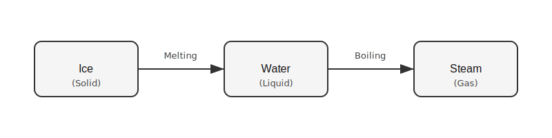
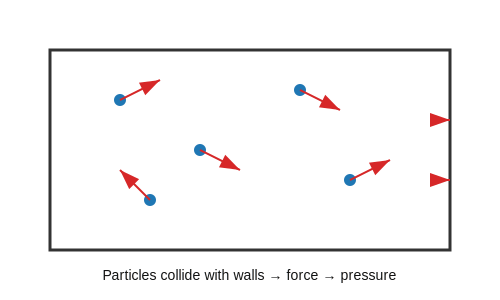

<!-- filename: physics3_particle-model-of-matter.md -->

# GCSEs for Dads – Physics 3: Particle Model of Matter

**Don’t worry about reading the formulas now. Just know they’re here at the top if you need them. Scroll down to start.**

You don’t need to memorise these straight away. Just get familiar with what they look like.

---

## Particle Model – Key Ideas

| Quantity | Key Idea | Meaning |
|----------|----------|---------|
| Particle model | Matter made of particles | Tiny particles always moving |
| Density | How packed particles are | Mass per volume |
| Internal energy | Total energy in particles | Kinetic + potential energy |
| Specific heat capacity | Energy to heat a substance | Energy per kg per °C |
| Gas pressure | Particle collisions | Force from particles hitting walls |

## Symbols and Units

| Symbol | Meaning | Unit |
|--------|---------|------|
| E | Energy | Joules (J) |
| m | Mass | kg |
| c | Specific heat capacity | J/kg°C |
| ΔT | Temperature change | °C |
| ρ | Density | kg/m³ |
| V | Volume | m³ |

---

# Physics 3: Particle Model of Matter

---

## 1. The Big Idea (30 seconds)

**Everything is made of tiny moving particles, and how they move explains almost everything.**

- Solids, liquids, gases are just different particle behaviours  
- Temperature = how fast particles move  
- Pressure = particles hitting surfaces  
- Changing state = changing movement, not particles  

Think of it like this:  
Same “stuff”, different movement patterns.

---

## 2. States of Matter

| State | Particle Behaviour | Shape |
|-------|--------------------|-------|
| Solid | tightly packed, vibrating | fixed |
| Liquid | close, sliding past each other | takes container shape |
| Gas | far apart, moving fast | fills container |

Solids:
- particles tightly packed
- fixed positions
- only vibrate

Liquids:
- particles still close
- can move past each other
- flow

Gases:
- particles far apart
- move quickly in random directions
- easily compressed

Key idea:
- The **spacing and movement** of particles explains everything

---

## 3. Density

Density tells you how tightly packed particles are.

Equation:
ρ = m ÷ V

- ρ = density
- m = mass
- V = volume

Example:
6 kg in 2 m³  
ρ = 6 ÷ 2 = 3 kg/m³

Key idea:
- solids = high density  
- gases = very low density  

---

## 4. Changes of State

| Change | Direction |
|--------|-----------|
| Melting | solid → liquid |
| Freezing | liquid → solid |
| Boiling | liquid → gas |
| Condensing | gas → liquid |

- particles do not change  
- only movement and spacing change  

Key idea:
- energy changes how particles move, not what they are  

---

## 5. Internal Energy

Internal energy = total energy in a substance.

Made of:
- kinetic energy (movement)
- potential energy (position)

Heating:
- particles move faster
- internal energy increases

Key idea:
- hotter = more internal energy  

---

## 6. Specific Heat Capacity

Different substances heat up differently.

Equation:
E = m × c × ΔT

- E = energy (J)
- m = mass (kg)
- c = specific heat capacity
- ΔT = temperature change (°C)

Example:
Water needs ~4200 J to heat 1 kg by 1°C

Key idea:
- high c = heats slowly  

---

## 7. Gas Pressure and Temperature

Gas pressure comes from particle collisions.

- particles hit container walls
- each collision = force

Pressure increases when:
- particles move faster  
- more collisions happen  

Heating a gas:
- particles speed up  
- collisions increase  
- pressure increases  

Key idea:
- faster particles = higher pressure  

---

## 8. Real Life Example

Bike pump gets warm because:

- air is compressed  
- particles collide more  
- internal energy increases  
- temperature rises  

---

## 9. Common Mistakes

- Thinking particles expand (they don’t, spacing changes)  
- Mixing up mass and density  
- Forgetting gases are mostly empty space  
- Thinking temperature changes particles themselves  
- Forgetting pressure depends on collisions  

---

## 10. Check Your Understanding

- Why are solids hard to compress? (particles are tightly packed with almost no gaps)  
- Why are gases easy to compress? (particles are far apart with large gaps)  
- What happens to particles when temperature increases? (they move faster)  
- What happens to pressure when a gas is heated in a sealed container? (pressure increases)  
- What is the equation for density? (ρ = m ÷ V)  
- What makes up internal energy? (kinetic and potential energy)  
- Why does water heat slowly? (high specific heat capacity)  
- What changes during a change of state? (movement and spacing, not particles)  

---

## 11. Useful Videos

[Particle Theory and States of Matter](https://youtu.be/zjkBMk5d3tM?si=tVjV6vPEYuMGpyr7)

[Gas pressure](https://youtu.be/eHizt31t1rs?si=A0-EeDoa4M9_OTry)
