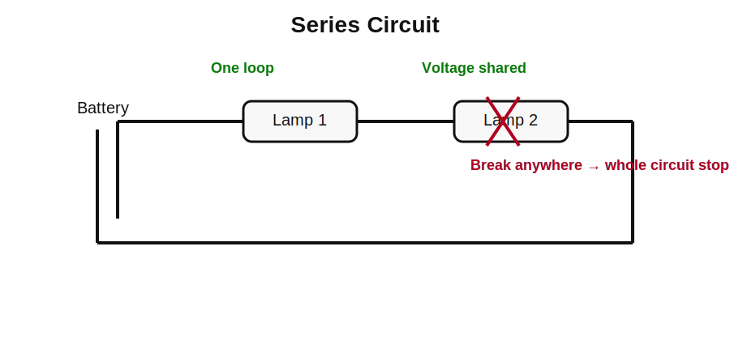
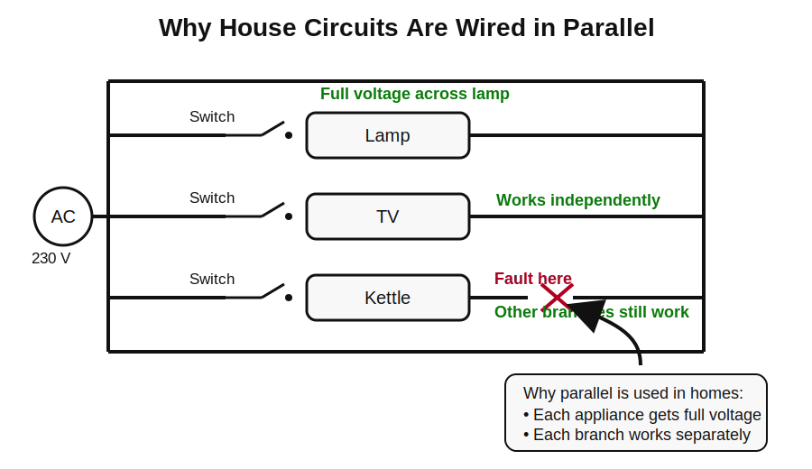

# GCSEs for Dads – Physics 2: Electricity

**Don’t worry about reading the formulas now. Just know they’re here at the top if you need them. Scroll down to start.**

You don’t need to memorise these formulas. Just know where to find them.

---

## Electricity Formulas

| Quantity | Formula | Meaning |
|----------|--------|---------|
| Charge | Q = I × t | charge transferred = current × time |
| Voltage | V = I × R | voltage = current × resistance |
| Power | P = V × I | electrical power = voltage × current |
| Energy transferred | E = P × t | energy = power × time |

## Symbols and Units

| Symbol | Meaning | Unit |
|--------|--------|------|
| Q | Charge | Coulombs (C) |
| I | Current | Amps (A) |
| V | Voltage | Volts (V) |
| R | Resistance | Ohms (Ω) |
| P | Power | Watts (W) |
| E | Energy | Joules (J) |
| t | Time | Seconds (s) |

---

# Physics 2: Electricity

## 1. What is Electricity?

Electricity is the flow of electric charge through a complete circuit.

- A complete circuit is needed for electricity to flow- .

Key parts of a circuit:

- Power source (cell or battery)  
- Wires  
- Components (lamp, resistor, motor etc.)

---

## 2. Electric Charge and Current

Inside metal wires there are tiny particles called electrons.

When a battery is connected, it pushes electrons around the circuit.

---

## 3. Current

Electric charge flows through a circuit.

Current is the rate of flow of charge.

Unit: Amps (A)

- A coulomb is simply a unit used to measure electric charge.
- 1 amp means 1 coulomb of charge flows each second.
- A coulomb is a large bundle of electrons.

Big current means lots of charge moving.  
Small current means little charge moving.

Charge equation:

- Q = I × t

Example:

If 2 A flows for 5 seconds:

- Q = 2 × 5 = 10 C

---

## 4. Voltage (Potential Difference)

Voltage is the energy transferred to each unit of charge.

Think of it like pressure pushing electricity through the circuit.

- Unit: Volts (V)
- Higher voltage means a stronger push.

---

## 5. Resistance

Resistance is how much a component opposes the current.

Think of it like narrowing a pipe.

Unit: Ohms (Ω)

Example:

- Thin wire means high resistance.  
- Thick wire means low resistance.

---

## 6. How they all fit together

Relationship between voltage, current and resistance:

- V = I × R

This is Ohm’s Law.

- Voltage is the push.  
- Current is the flow.  
- Resistance is the restriction.

So:

Push = Flow × Restriction

- Voltage does not flow.  
- Current flows.  
- Resistance controls the flow.

---

## 7. Circuits

### 7.1 Series Circuits

A series circuit has one loop.

Rules:

- Current is the same everywhere.  
- Voltage is shared between components.  
- Total resistance = sum of resistances.

Example:

R₁ = 3Ω  
R₂ = 2Ω  

Total resistance = 5Ω  

If one component breaks, the whole circuit stops.

---

### 7.2 Parallel Circuits

A parallel circuit has multiple paths.

Rules:

- Voltage is the same across each branch.  
- Current splits across branches.  
- Resistance decreases when more branches are added.

Example:

- If one lamp breaks, the others still work because each branch is its own circuit.
- This is why homes use parallel circuits.

---

## 8. Electrical Power

Power is the rate energy is transferred.

- Unit: Watts (W)

Equation:
- P = V × I

Example:
- 230 V appliance drawing 2 A
- P = 230 × 2 = 460 W
---

## 9. Mains Electricity (UK)

Homes use AC electricity.

UK mains supply:

- 230 V  
- 50 Hz  

Dangerous because high voltage can push large currents through the body.

---

## 10. Domestic Wiring Safety

Homes use several safety devices.

- Fuse – melts and breaks the circuit if current gets too high.  
- Circuit breaker (MCB) – switches off automatically if current is too large.  
- Earth wire – protects users if metal casing becomes live.  
- Double insulation – used in appliances like phone chargers.

---

## Check your understanding

- What is the unit of current? (Amp, A)  
- What is the unit of resistance? (Ohm, Ω)  
- What does voltage measure? (energy transferred per unit charge)  
- In the water pipe analogy, what does current represent? (flow rate of water)  
- In the analogy, what does voltage represent? (pressure pushing the water)  
- What does resistance represent? (a narrow pipe slowing the flow)  
- If you increase the voltage in a circuit with the same resistance, what happens to the current? (the current increases)  
- If resistance increases, what happens to the current? (the current decreases)  
- Two bulbs are connected in series. What happens if one bulb breaks? (the whole circuit stops working)  
- Why? (because the circuit is no longer complete)  
- Your house lights are wired in parallel. What happens if one bulb blows? (the other lights still work)  
- Why? (each branch has its own path for current)  

---

## Now watch these

[GCSE Physics - Current, Voltage & Resistance](https://www.youtube.com/watch?v=rFd-vzU4_pg&utm)

[GCSE Physics - Voltage, Current & Resistance (V = IR)](hhttps://www.youtube.com/watch?v=BbizKa6eywo&utm)

[GCSE Physics - Series Circuits](https://www.youtube.com/watch?v=Hk4JEB5DITw&utm)

[GCSE Physics - Parallel Circuits](https://www.youtube.com/watch?v=GIvE5Zlpea8&utm)