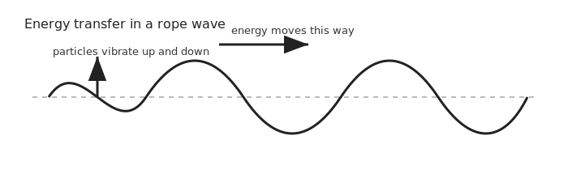
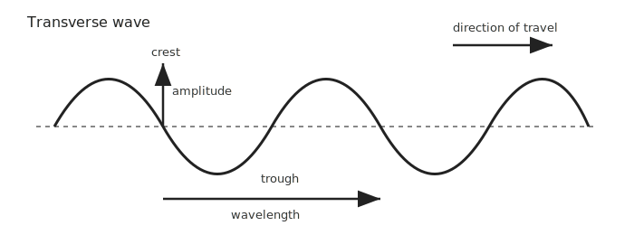
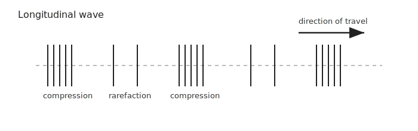
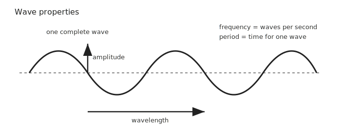
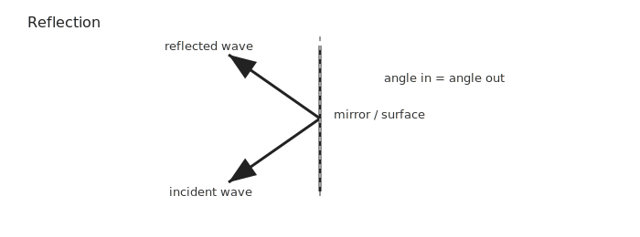
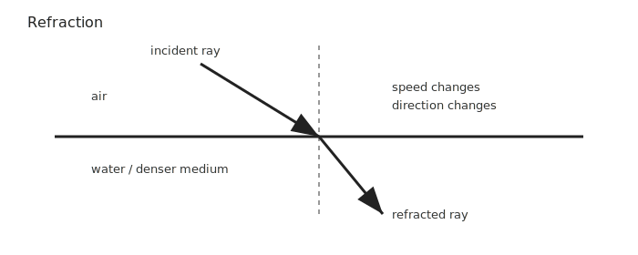

# GCSEs for Dads – Physics 6: Waves

**Don’t worry about reading the formulas now. Just know they’re here at the top if you need them. Scroll down to start.**

You don’t need to memorise these formulas. Just know where to find them. :contentReference[oaicite:0]{index=0}

---

## Waves Formulas

| Quantity | Formula | Meaning |
|----------|---------|---------|
| Wave speed | v = f × λ | wave speed = frequency × wavelength |
| Period | T = 1 / f | time taken for one wave |
| Wave speed | v = distance ÷ time | used when measuring waves travelling a distance |

## Symbols and Units

| Symbol | Meaning | Unit |
|--------|---------|------|
| v | Wave speed | m/s |
| f | Frequency | Hertz (Hz) |
| λ | Wavelength | metres (m) |
| T | Period | seconds (s) |

---

# Physics 6: Waves

## 1. The Big Idea (30 seconds)

- A wave transfers energy from one place to another.
- A wave does **not** transfer matter overall.
- In many waves, particles just vibrate around a fixed position.
- The energy moves through the medium, not the material itself. :contentReference[oaicite:1]{index=1}

### Think of it like this:
If you flick one end of a rope, the shape moves along the rope, but the rope itself does not travel from your hand to the other end.

---

## 2. Types of Wave

There are two main types you need to know.

### Transverse waves
- Vibrations are **perpendicular** to the direction of travel.
- That means the wave moves one way, while the particles move at right angles to it.
- Examples include:
  - water surface waves
  - light waves
  - all electromagnetic waves :contentReference[oaicite:2]{index=2}

Key parts:
- **crest** = highest point
- **trough** = lowest point
- **wavelength** = distance from one crest to the next crest

### Longitudinal waves
- Vibrations are **parallel** to the direction of travel.
- That means the particles move back and forth in the same direction the wave travels.
- Main example: **sound waves**. :contentReference[oaicite:3]{index=3}

Key parts:
- **compression** = particles close together
- **rarefaction** = particles spread apart

---

## 3. Wave Properties

All waves have a few core properties you need to recognise.

### Amplitude
- The maximum displacement from the middle position.
- Bigger amplitude usually means more energy.
- In sound, bigger amplitude means louder sound.

### Wavelength (λ)
- The distance between two matching points on a wave.
- Usually measured crest to crest, trough to trough, or compression to compression.

### Frequency (f)
- The number of complete waves passing a point each second.
- Measured in **Hertz (Hz)**.

### Period (T)
- The time taken for one complete wave.
- Measured in seconds.

### Frequency and period relationship
- High frequency means short period.
- Low frequency means long period. :contentReference[oaicite:4]{index=4}

---

## 4. Wave Speed

Wave speed tells us how fast a wave travels.

### Formula
**v = f × λ**

Where:
- **v** = wave speed in m/s
- **f** = frequency in Hz
- **λ** = wavelength in m :contentReference[oaicite:5]{index=5}

### Worked example
A wave has:
- frequency = **4 Hz**
- wavelength = **2 m**

So:

**v = f × λ**  
**v = 4 × 2**  
**v = 8 m/s**

The wave travels **8 metres each second**. :contentReference[oaicite:6]{index=6}

### Typical wave speeds
- sound in air ≈ **340 m/s**
- sound in water ≈ **1500 m/s**
- light in vacuum ≈ **3 × 10⁸ m/s** :contentReference[oaicite:7]{index=7}

---

## 5. Reflection

Reflection happens when a wave bounces off a surface.

Examples:
- light reflecting in a mirror
- sound echoing off a cliff or wall :contentReference[oaicite:8]{index=8}

### Rule of reflection
**Angle of incidence = angle of reflection**

Important facts:
- the **direction** changes
- the **frequency stays the same**

Reflection is used in:
- mirrors
- echo sounding
- ultrasound imaging :contentReference[oaicite:9]{index=9}

---

## 6. Refraction

Refraction happens when a wave enters a different medium and changes speed.

Examples:
- light moving from air into water
- water waves moving into shallow water :contentReference[oaicite:10]{index=10}

Key facts:
- **wave speed changes**
- **wavelength changes**
- **frequency stays the same**

Because the wave changes speed, it often changes direction too.

A classic example is a straw looking bent in a glass of water. That is light being refracted. :contentReference[oaicite:11]{index=11}

---

## 7. Sound Waves

Sound waves are **longitudinal waves**. :contentReference[oaicite:12]{index=12}

They can travel through:
- solids
- liquids
- gases

They **cannot** travel through a vacuum because there are no particles to vibrate. :contentReference[oaicite:13]{index=13}

### Speed of sound
Sound travels:
- slowest in gases
- faster in liquids
- fastest in solids :contentReference[oaicite:14]{index=14}

### Sound wave properties
- amplitude links to **loudness**
- frequency links to **pitch** :contentReference[oaicite:15]{index=15}

### Real life example
You see lightning before you hear thunder because light travels much faster than sound. :contentReference[oaicite:16]{index=16}

---

## 8. Check Your Understanding

- What does a wave transfer?
- Why does a wave not transfer matter overall?
- What is the difference between transverse and longitudinal waves?
- What does wavelength measure?
- What does frequency measure?
- What happens to wavelength when a wave enters a different medium?
- Why can sound not travel through space?
- What does amplitude tell you about a sound wave?
- What does frequency tell you about a sound wave?

---

## 9. Quick Memory Hooks

- **wave** = energy moves
- **transverse** = vibrations at right angles
- **longitudinal** = vibrations in the same direction
- **amplitude** = height / energy
- **frequency** = waves per second
- **wavelength** = length of one wave
- **reflection** = bounce
- **refraction** = change of speed and direction

---

## 10. Common Traps

- Thinking waves carry matter from one place to another
- Mixing up wavelength and amplitude
- Forgetting that **frequency stays the same** during refraction
- Forgetting that sound is **longitudinal**
- Forgetting that sound cannot travel through a vacuum

---

## 11. Now Watch These

- [Waves Explained](https://www.youtube.com/results?search_query=cognito+gcse+physics+waves)
- [Transverse and Longitudinal Waves](https://www.youtube.com/results?search_query=cognito+transverse+and+longitudinal+waves)
- [Wave Speed Equation](https://www.youtube.com/results?search_query=cognito+wave+speed+equation+gcse)

---

