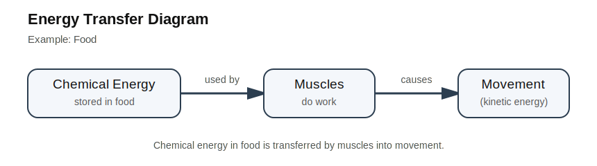
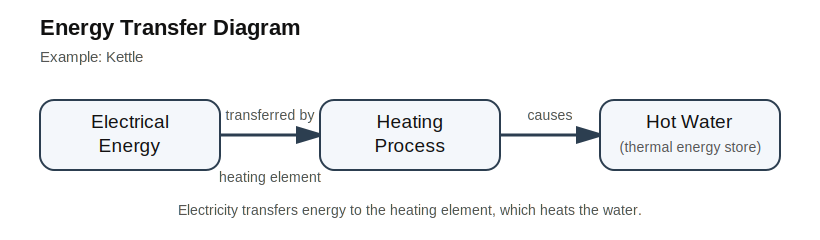
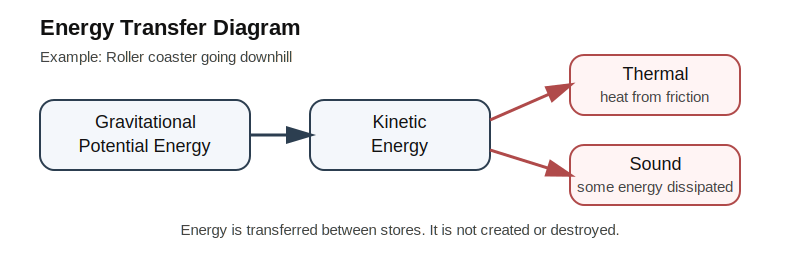

# GCSEs for Dads – Physics 1: Energy

**Don’t worry about reading the formulas now. Just know they’re here at the top if you need them. Scroll down to start.**

You don’t need to memorise these formulas. Just know where to find them.

---

## Energy Formulas

| Quantity | Formula | Meaning |
|----------|--------|---------|
| Kinetic Energy | Ek = ½mv² | mass × velocity² ÷ 2 |
| Power | P = E / t | energy transferred per second |
| Gravitational Potential Energy | Ep = mgh | mass × gravity × height |
| Elastic Potential Energy | Ee = ½ke² | spring constant × extension² ÷ 2 |
| Work Done | W = F × d | force × distance moved |
| Efficiency | efficiency = useful energy output / total energy input | useful energy ÷ total energy |

---

# Physics 1: Energy

## 1. The Big Idea (30 seconds)

- Energy cannot be created or destroyed  
- It only moves between different energy stores  

#### Example

A roller coaster starts at the top:

- Gravitational energy is high  
- As it drops, energy transfers to kinetic energy (movement)  
- Some energy is transferred to thermal energy (lost as heat) due to friction  

**Key takeaway:** Total energy stays the same  

---

## 2. Energy Stores

Energy exists in different places called stores

- Kinetic - moving bike  
- Thermal - hot object  
- Gravitational potential - object at height  
- Elastic potential - stretched spring  
- Chemical - food, fuel, batteries  
- Nuclear - atomic energy  

Advanced (rarely seen in GCSE)

- Magnetic  
- Electrostatic  

---

## 3. Energy Transfers

Energy transfers between stores in four ways

- Mechanically - pushing an object  
- Electrically - current in a wire  
- Heating - warming objects  
- Radiation - sunlight or infrared  

---

## 4. Important GCSE Ideas

Energy is conserved  

- Total energy never disappears  
- It only transfers between stores  

Energy is often wasted, usually as heat or sound  

#### Example: Driving  

Car engine → movement + heat  

---

## 5. Energy Transfer Diagrams

---

## 6. 15-Minute Learning Mode (watch together)

Watch 3 short videos:

[Energy stores and transfers](https://youtu.be/JGwcDCeYRYo?si=YV2PrX3YIe4ItV_n)

[Kinetic and gravitational energy](https://youtu.be/244-42IQGYU?si=Tm8SliTGuoQ7qxmn)

[Power and efficiency](https://youtu.be/KbrqbW0um0Y?si=J8xJlmdxEVv8MA3i)

---

## 7. Check your understanding

### Question 1 – Concept question

A roller coaster starts at the top of a hill and rolls down  

Explain why the roller coaster moves faster as it goes downhill  

**Answer**

- At the top, the roller coaster has gravitational potential energy  
- As it moves down, this energy transfers into kinetic energy  
- Kinetic energy is the energy of movement, so the coaster speeds up  

For a bonus point, why does it slow down on the way up?  

- As the coaster goes uphill, kinetic energy is transferred back into gravitational potential energy  
- This reduces movement energy, so it slows down  

For another point, why doesn’t it reach the same height?  

- Some energy is transferred to heat and sound due to friction, so less energy remains  

---

### Question 2 – Real-life application

A car brakes suddenly and the brakes become very hot. Why?  

**Answer**

- The car has kinetic energy because it is moving  
- Braking creates friction, which slows the car  
- This transfers kinetic energy into thermal energy, heating the brakes  