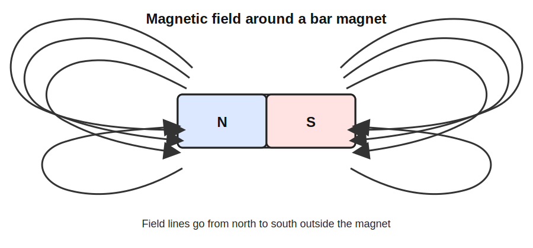
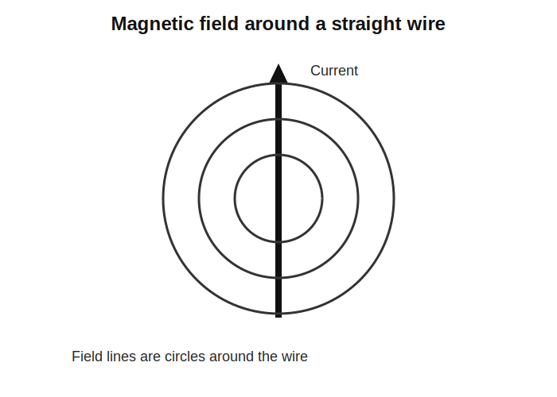
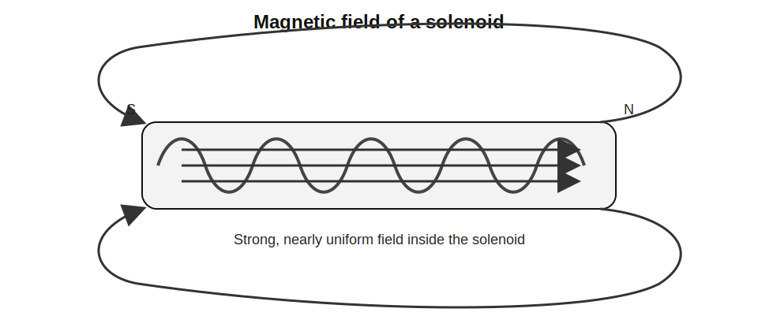
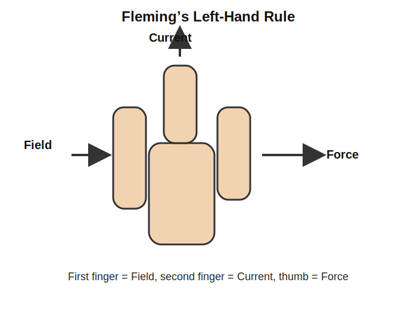
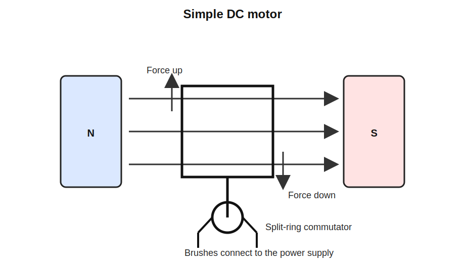
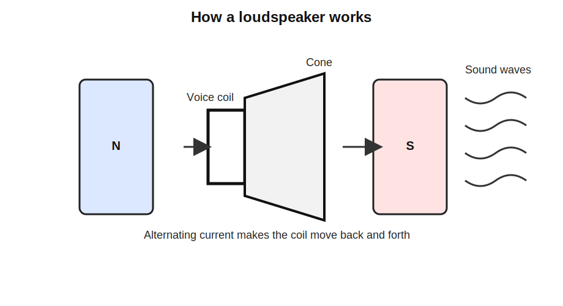

# GCSEs for Dads – Physics 7: Magnetism and Electromagnetism

**Don’t worry about reading the formulas now. Just know they’re here at the top if you need them. Scroll down to start.**

You don’t need to memorise these formulas. Just know where to find them.

---

## Magnetism and Electromagnetism Formulas

| Quantity | Formula | Meaning |
|----------|---------|---------|
| Magnetic force on a current-carrying wire | F = B × I × L | force on a wire in a magnetic field |
| Magnetic flux density | B = F ÷ (I × L) | magnetic field strength calculated from force, current and wire length |

## Symbols and Units

| Symbol | Meaning | Unit |
|--------|---------|------|
| F | Force | Newton (N) |
| B | Magnetic flux density | Tesla (T) |
| I | Current | Ampere (A) |
| L | Length of wire in magnetic field | metres (m) |

---

# Physics 7: Magnetism and Electromagnetism

## 1. The Big Idea (30 seconds)

- Magnets create magnetic fields.
- Magnetic fields can push or pull magnetic materials and other magnets.
- Electric current also creates magnetic fields.
- A coil of wire can be turned into an electromagnet.
- If a current-carrying wire sits in a magnetic field, it feels a force.
- This is the basis of motors and loudspeakers.

---

## 2. Magnetic Fields

A magnetic field is the region around a magnet where magnetic forces act.

### Key ideas

- Magnets have two poles: north and south.
- Opposite poles attract.
- Like poles repel.
- Magnetic forces act at a distance without touching.
- Magnetic fields are strongest at the poles.

### Magnetic field lines

Magnetic fields are usually shown using field lines.

Important properties of magnetic field lines:

- They run from north pole to south pole.
- They never cross.
- The closer the lines are, the stronger the field.

The field is strongest where the lines are closest together, usually at the poles.

**Real-life example:** The Earth has a magnetic field, which is why a compass needle points north.

---

## 3. Magnetic Materials

Some materials are magnetic and can be attracted by magnets.

### Examples of magnetic materials

- iron
- steel
- nickel
- cobalt

### Permanent magnets

- Produce their own magnetic field.
- Do not easily lose their magnetism.

### Induced magnets

- Become magnetic when placed in a magnetic field.
- Lose magnetism when the field is removed.

Soft iron magnetises easily, but also loses its magnetism easily. That makes it useful in electromagnets.

**Real-life example:** A paperclip can become magnetised when placed near a strong magnet.

---

## 4. Magnetic Fields Around a Current-Carrying Wire

When electric current flows through a wire, it creates a magnetic field around the wire.

The field lines form circles around the wire.

### Right-hand grip rule

Use the right-hand grip rule to work out the field direction:

- Thumb points in the direction of the current.
- Fingers curl in the direction of the magnetic field.

**Key idea:** Electric current always produces a magnetic field.

**Real-life example:** This effect is used inside electromagnets and motors.

---

## 5. The Solenoid

A solenoid is a long coil of wire carrying an electric current.

When current flows through it, it produces a magnetic field like a bar magnet.

### Properties of a solenoid

- It has a north and south pole.
- The magnetic field inside the coil is strong.
- The field inside is also uniform.
- The field outside is weaker.

A **uniform magnetic field** means the field strength is the same all the way through that region.

### Ways to increase the strength of a solenoid

- Increase the current.
- Add more turns of wire.
- Insert an iron core.

**Real-life example:** Solenoids are used in relays and electric door locks.

---

## 6. Electromagnets

An electromagnet is a magnet made by current flowing through a coil of wire around an iron core.

Electromagnets are useful because:

- they can be switched on and off
- their strength can be changed

### Ways to increase the strength of an electromagnet

- Increase the current.
- Increase the number of turns in the coil.
- Use a soft iron core.

**Real-life example:** Scrapyard cranes use electromagnets to lift steel.

---

## 7. The Motor Effect

When a current-carrying wire is placed in a magnetic field, a force acts on the wire.

This is called the **motor effect**.

### Fleming’s Left-Hand Rule

Use Fleming’s Left-Hand Rule to work out the direction of the force:

- First finger = magnetic field
- Second finger = current
- Thumb = force or motion

### The force gets bigger when

- the current is larger
- the magnetic field is stronger
- more wire is inside the magnetic field

**Real-life example:** Electric motors use the motor effect to create movement.

---

## 8. Electric Motors

Electric motors convert electrical energy into kinetic energy.

### How a simple motor works

- A current flows through a coil inside a magnetic field.
- Forces act on opposite sides of the coil.
- The forces act in opposite directions.
- This makes the coil rotate.
- A split-ring commutator reverses the current every half turn.
- This keeps the coil turning in the same direction.

**Real-life example:** Electric motors are used in fans, washing machines and electric cars.

---

## 9. Loudspeakers

Loudspeakers use the motor effect to make sound.

### How a loudspeaker works

- An alternating current flows through a coil.
- The coil sits in a magnetic field.
- The current keeps changing direction.
- This makes the coil move backwards and forwards.
- The coil is attached to a cone.
- The cone vibrates and makes sound waves in the air.

**Real-life example:** Headphones, phone speakers and hi-fi speakers all work using this idea.

---

## 10. Check your understanding

- Why are magnetic fields strongest at the poles of a magnet?
- How is an induced magnet different from a permanent magnet?
- Why are the field lines around a straight wire circular?
- What does the right-hand grip rule tell you?
- Why does adding an iron core make a solenoid stronger?
- What is the motor effect in one sentence?
- What do the three fingers represent in Fleming’s Left-Hand Rule?
- Why does a motor need a split-ring commutator?
- Why does a loudspeaker cone move backwards and forwards instead of in one direction?

---

## 11. Common mistakes and quick fixes

- **Mixing up attraction and repulsion**  
  Opposite poles attract, like poles repel.

- **Forgetting that current creates magnetism**  
  A current-carrying wire always produces a magnetic field.

- **Confusing right-hand and left-hand rules**  
  Right hand grip rule is for magnetic field around a wire.  
  Fleming’s Left-Hand Rule is for force in the motor effect.

- **Forgetting how to strengthen an electromagnet**  
  Think: more current, more turns, iron core.

- **Thinking the motor just keeps spinning automatically**  
  The commutator is needed to reverse the current every half turn.

---

## 12. YouTube links

- [Magnets](https://youtu.be/3elpPfyHV0E?si=sURBOvWx1MLQ9cUO)
- [Electromagnetism](https://youtu.be/LTfP8yPAVFw?si=EAgImsZllDYRkoUs)

---
